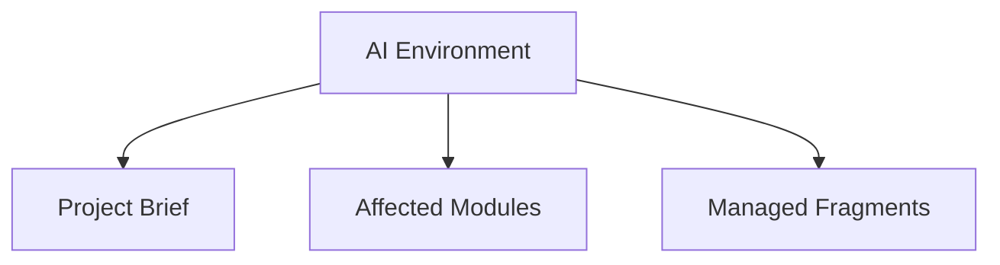

# AI_ENVIRONMENT: Day Tracker

> Managed document. Must comply with template AI_ENVIRONMENT.template.md.

<!-- APM:DATA
{
  "docType": "ai_environment",
  "version": 1,
  "markdown": "# AI Environment: Day Tracker\n\n## 0. Locked System Directives\n\n<\u0021--\nAPM-ID: document-0-use-the-project-workspace-folder-for-volatile-ai\n--\u003e\n\n### 0.1 Use the project workspace folder for volatile AI work\n\nUse C:\\Users\\croni\\Projects\\Goals\\Day Tracker\\.apm\\_WORKSPACE for messy AI work such as TODO lists, draft plans, scratch notes, and temporary working files. Keep the project root and docs folder focused on real project artifacts.\n\n<\u0021--\nAPM-ID: document-0-record-document-impacting-changes-in-the-change-log-with\n--\u003e\n\n### 0.2 Record document-impacting changes in the Change Log with stable target references\n\nWhen feature or bug work updates a managed document, create or update a Change Log entry that references the work item code, target document, target section number, stable target item id, and a short human-readable summary of the change.\n\n<\u0021--\nAPM-ID: document-0-keep-generated-stored-titles-short-and-storage-safe\n--\u003e\n\n### 0.3 Keep generated stored titles short and storage-safe\n\nWhen AI generates fragments or any structured data that will be stored, keep titles and other short stored fields as short as the database allows. Prefer concise complete titles over truncated prose, and put longer detail in descriptions or body content.\n\n## 1. Applied Shared Profiles\n\nNo shared AI profiles are currently applied.\n\n## 2. Mission\n\n<\u0021--\nAPM-ID: ai-environment-overview-mission-mission\nAPM-LAST-UPDATED: 2026-04-06\n--\u003e\n\nGuide AI agents working on Day Tracker.\n\n## 3. Operating Model\n\n<\u0021--\nAPM-ID: ai-environment-overview-operating-model-operating-model\nAPM-LAST-UPDATED: 2026-04-06\n--\u003e\n\nRead the project context first, update the correct modules, and keep generated artifacts consistent with the database-first workflow.\n\n## 4. Communication Style\n\n<\u0021--\nAPM-ID: ai-environment-overview-communication-style-communication-style\nAPM-LAST-UPDATED: 2026-04-06\n--\u003e\n\nBe concise, explicit about assumptions, and preserve traceability between features, bugs, documents, and fragments.\n\n## 5. Required Behaviors\n\n<\u0021--\nAPM-ID: ai-environment-required-behaviors-read-project-context-first\nAPM-LAST-UPDATED: 2026-04-06\n--\u003e\n\n### 5.1 Read project context first\n\nReview Project Brief, Roadmap, and module-specific state before proposing or applying changes.\n\n- Version Date: 2026-04-06\n\n## 6. Module Update Rules\n\n<\u0021--\nAPM-ID: ai-environment-module-update-rules-update-adjacent-modules-when-scope-changes\nAPM-LAST-UPDATED: 2026-04-06\n--\u003e\n\n### 6.1 Update adjacent modules when scope changes\n\nIf feature or bug work affects product, roadmap, schema, or architecture understanding, update the corresponding module state and fragments.\n\n- Version Date: 2026-04-06\n\n## 7. Data Structure and Phrasing Rules\n\n<\u0021--\nAPM-ID: ai-environment-data-phrasing-rules-use-structured-deterministic-wording\nAPM-LAST-UPDATED: 2026-04-06\n--\u003e\n\n### 7.1 Use structured, deterministic wording\n\nPrefer short titles, explicit descriptions, stable identifiers, and schema-safe phrasing that can be consumed by both humans and automation.\n\n- Version Date: 2026-04-06\n\n## 8. Avoid / Guardrails\n\n<\u0021--\nAPM-ID: ai-environment-avoid-rules-do-not-bypass-source-of-truth\nAPM-LAST-UPDATED: 2026-04-06\n--\u003e\n\n### 8.1 Do not bypass source of truth\n\nDo not overwrite generated markdown or DBML directly when the module uses database-first state.\n\n- Version Date: 2026-04-06\n\n## 9. Custom Instructions\n\n<\u0021--\nAPM-ID: ai-environment-custom-instructions-custom-instructions\nAPM-LAST-UPDATED: 2026-04-06\n--\u003e\n\nNo custom instructions added yet.\n\n## 10. Handoff Checklist\n\n<\u0021--\nAPM-ID: ai-environment-handoff-checklist-record-affected-modules\nAPM-LAST-UPDATED: 2026-04-06\n--\u003e\n\n### 10.1 Record affected modules\n\nWhen a bug or feature changes multiple areas, note the affected modules so downstream documents stay aligned.\n\n- Version Date: 2026-04-06",
  "mermaid": "flowchart TD\n  ai[\"AI Environment\"] --\u003e brief[\"Project Brief\"]\n  ai --\u003e modules[\"Affected Modules\"]\n  ai --\u003e fragments[\"Managed Fragments\"]",
  "editorState": {
    "selectedProfileIds": [],
    "overview": {
      "mission": "Guide AI agents working on Day Tracker.",
      "operatingModel": "Read the project context first, update the correct modules, and keep generated artifacts consistent with the database-first workflow.",
      "communicationStyle": "Be concise, explicit about assumptions, and preserve traceability between features, bugs, documents, and fragments.",
      "versionDate": "2026-04-06T03:36:29.924Z",
      "itemIds": {
        "mission": "ai-environment-overview-mission-mission",
        "operatingModel": "ai-environment-overview-operating-model-operating-model",
        "communicationStyle": "ai-environment-overview-communication-style-communication-style"
      },
      "itemSourceRefs": {
        "mission": [],
        "operatingModel": [],
        "communicationStyle": []
      }
    },
    "requiredBehaviors": [
      {
        "title": "Read project context first",
        "description": "Review Project Brief, Roadmap, and module-specific state before proposing or applying changes.",
        "versionDate": "2026-04-06T03:36:29.924Z",
        "id": "",
        "stableId": "ai-environment-required-behaviors-read-project-context-first",
        "sourceRefs": []
      }
    ],
    "moduleUpdateRules": [
      {
        "title": "Update adjacent modules when scope changes",
        "description": "If feature or bug work affects product, roadmap, schema, or architecture understanding, update the corresponding module state and fragments.",
        "versionDate": "2026-04-06T03:36:29.924Z",
        "id": "",
        "stableId": "ai-environment-module-update-rules-update-adjacent-modules-when-scope-changes",
        "sourceRefs": []
      }
    ],
    "dataPhrasingRules": [
      {
        "title": "Use structured, deterministic wording",
        "description": "Prefer short titles, explicit descriptions, stable identifiers, and schema-safe phrasing that can be consumed by both humans and automation.",
        "versionDate": "2026-04-06T03:36:29.924Z",
        "id": "",
        "stableId": "ai-environment-data-phrasing-rules-use-structured-deterministic-wording",
        "sourceRefs": []
      }
    ],
    "avoidRules": [
      {
        "title": "Do not bypass source of truth",
        "description": "Do not overwrite generated markdown or DBML directly when the module uses database-first state.",
        "versionDate": "2026-04-06T03:36:29.924Z",
        "id": "",
        "stableId": "ai-environment-avoid-rules-do-not-bypass-source-of-truth",
        "sourceRefs": []
      }
    ],
    "handoffChecklist": [
      {
        "title": "Record affected modules",
        "description": "When a bug or feature changes multiple areas, note the affected modules so downstream documents stay aligned.",
        "versionDate": "2026-04-06T03:36:29.924Z",
        "id": "",
        "stableId": "ai-environment-handoff-checklist-record-affected-modules",
        "sourceRefs": []
      }
    ],
    "customInstructions": "",
    "fragmentHistory": [],
    "customInstructionsMeta": {
      "stableId": "ai-environment-custom-instructions-custom-instructions",
      "sourceRefs": []
    }
  }
}
-->

# AI Environment: Day Tracker

## 0. Locked System Directives

<!--
APM-ID: document-0-use-the-project-workspace-folder-for-volatile-ai
-->

### 0.1 Use the project workspace folder for volatile AI work

Use C:\Users\croni\Projects\Goals\Day Tracker\.apm\_WORKSPACE for messy AI work such as TODO lists, draft plans, scratch notes, and temporary working files. Keep the project root and docs folder focused on real project artifacts.

<!--
APM-ID: document-0-record-document-impacting-changes-in-the-change-log-with
-->

### 0.2 Record document-impacting changes in the Change Log with stable target references

When feature or bug work updates a managed document, create or update a Change Log entry that references the work item code, target document, target section number, stable target item id, and a short human-readable summary of the change.

<!--
APM-ID: document-0-keep-generated-stored-titles-short-and-storage-safe
-->

### 0.3 Keep generated stored titles short and storage-safe

When AI generates fragments or any structured data that will be stored, keep titles and other short stored fields as short as the database allows. Prefer concise complete titles over truncated prose, and put longer detail in descriptions or body content.

## 1. Applied Shared Profiles

No shared AI profiles are currently applied.

## 2. Mission

<!--
APM-ID: ai-environment-overview-mission-mission
APM-LAST-UPDATED: 2026-04-06
-->

Guide AI agents working on Day Tracker.

## 3. Operating Model

<!--
APM-ID: ai-environment-overview-operating-model-operating-model
APM-LAST-UPDATED: 2026-04-06
-->

Read the project context first, update the correct modules, and keep generated artifacts consistent with the database-first workflow.

## 4. Communication Style

<!--
APM-ID: ai-environment-overview-communication-style-communication-style
APM-LAST-UPDATED: 2026-04-06
-->

Be concise, explicit about assumptions, and preserve traceability between features, bugs, documents, and fragments.

## 5. Required Behaviors

<!--
APM-ID: ai-environment-required-behaviors-read-project-context-first
APM-LAST-UPDATED: 2026-04-06
-->

### 5.1 Read project context first

Review Project Brief, Roadmap, and module-specific state before proposing or applying changes.

- Version Date: 2026-04-06

## 6. Module Update Rules

<!--
APM-ID: ai-environment-module-update-rules-update-adjacent-modules-when-scope-changes
APM-LAST-UPDATED: 2026-04-06
-->

### 6.1 Update adjacent modules when scope changes

If feature or bug work affects product, roadmap, schema, or architecture understanding, update the corresponding module state and fragments.

- Version Date: 2026-04-06

## 7. Data Structure and Phrasing Rules

<!--
APM-ID: ai-environment-data-phrasing-rules-use-structured-deterministic-wording
APM-LAST-UPDATED: 2026-04-06
-->

### 7.1 Use structured, deterministic wording

Prefer short titles, explicit descriptions, stable identifiers, and schema-safe phrasing that can be consumed by both humans and automation.

- Version Date: 2026-04-06

## 8. Avoid / Guardrails

<!--
APM-ID: ai-environment-avoid-rules-do-not-bypass-source-of-truth
APM-LAST-UPDATED: 2026-04-06
-->

### 8.1 Do not bypass source of truth

Do not overwrite generated markdown or DBML directly when the module uses database-first state.

- Version Date: 2026-04-06

## 9. Custom Instructions

<!--
APM-ID: ai-environment-custom-instructions-custom-instructions
APM-LAST-UPDATED: 2026-04-06
-->

No custom instructions added yet.

## 10. Handoff Checklist

<!--
APM-ID: ai-environment-handoff-checklist-record-affected-modules
APM-LAST-UPDATED: 2026-04-06
-->

### 10.1 Record affected modules

When a bug or feature changes multiple areas, note the affected modules so downstream documents stay aligned.

- Version Date: 2026-04-06

## Mermaid

