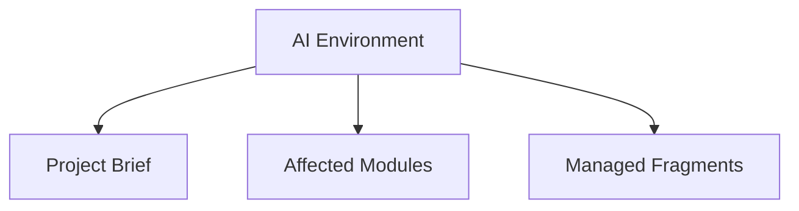

# AI_ENVIRONMENT: Day Tracker

> Managed document. Must comply with template AI_ENVIRONMENT.template.md.

<!-- APM:DATA
{
  "docType": "ai_environment",
  "version": 1,
  "markdown": "# AI Environment: Day Tracker\n\n## 1. Mission\n\n<\u0021--\nAPM-ID: ai-environment-overview-mission-mission\nAPM-LAST-UPDATED: 2026-04-14\n--\u003e\n\nGuide AI agents working on Day Tracker.\n\n## 2. Operating Model\n\n<\u0021--\nAPM-ID: ai-environment-overview-operating-model-operating-model\nAPM-LAST-UPDATED: 2026-04-14\n--\u003e\n\nRead the project context first, update the correct modules, and keep generated artifacts consistent with the database-first workflow.\n\n## 3. Communication Style\n\n<\u0021--\nAPM-ID: ai-environment-overview-communication-style-communication-style\nAPM-LAST-UPDATED: 2026-04-14\n--\u003e\n\nBe concise, explicit about assumptions, and preserve traceability between features, bugs, documents, and fragments.\n\n## 4. APM Term Dictionary\n\n| Term | Definition | Stable ID | Source Refs |\n| --- | --- | --- | --- |\n| APM | Angel's Project Manager, the application that manages project state, modules, generated documents, fragments, and AI operating context. | ai-environment-term-dictionary-apm |  |\n| Project | A managed workspace or folder whose planning, software design, documents, fragments, and AI guidance are tracked by APM. | ai-environment-term-dictionary-project |  |\n| Module | A functional area inside APM, such as PRD, Functional Spec, Domain Models, Database Schema, Architecture, Features, Bugs, or AI Environment. | ai-environment-term-dictionary-module |  |\n| AI Environment | The project-level operating guide that tells AI agents how to read, update, and preserve context for the current project. | ai-environment-term-dictionary-ai-environment |  |\n| Directive Project | The project selected in Application Settings where APM writes application-level AI directives that are specific to APM itself. | ai-environment-term-dictionary-directive-project |  |\n| Fragment | A structured proposal file consumed by a module to add, update, remove, or transform managed project data without editing generated documents directly. | ai-environment-term-dictionary-fragment |  |\n| Managed Document | A markdown document generated from persisted module state and metadata rather than treated as the primary source of truth. | ai-environment-term-dictionary-managed-document |  |\n| Stable ID | A persistent human-readable identifier used by documents, fragments, UI nodes, and cross-module references to target the same concept over time. | ai-environment-term-dictionary-stable-id |  |\n| Work Item Code | A human-readable code such as FEAT-001, BUG-010, or TASK-001 that links document changes to planned work, bugs, or tasks. | ai-environment-term-dictionary-work-item-code |  |\n| Emitted Directive | A directive owned by a module template that is surfaced in the AI Environment index so agents know which module-specific instructions to read. | ai-environment-term-dictionary-emitted-directive |  |\n\n## 5. Custom Instructions\n\n<\u0021--\nAPM-ID: ai-environment-custom-instructions-custom-instructions\nAPM-LAST-UPDATED: 2026-04-14\n--\u003e\n\nNo custom instructions added yet.\n\n## 6. Applied Shared Profiles\n\nNo shared AI profiles are currently applied.\n\n## 7. Module AI and Template References\n\nModule AI files remain authoritative for module-specific AI behavior. Read the module AI file first, then the paired document and fragment templates for literal artifact shape.\n\nDocument templates describe the final managed-document contract and reconciliation shape that APM writes or re-imports.\n\nFragment templates are the normal AI write path. Fill the fragment template, save the fragment to the configured fragments path, and let APM consume it into the growing module state and generated document.\n\n- Roadmap: AI: `ai/modules/ROADMAP.ai.md`; Document Template: `templates/ROADMAP.template.md`; Fragment Template: `templates/ROADMAP_FRAGMENT.template.md`\n- Features: AI: `ai/modules/FEATURES.ai.md`; Document Template: `templates/FEATURES.template.md`; Fragment Template: `templates/FEATURES_FRAGMENT.template.md`\n- Bugs: AI: `ai/modules/BUGS.ai.md`; Document Template: `templates/BUGS.template.md`; Fragment Template: `templates/BUGS_FRAGMENT.template.md`\n- Change Log: AI: `ai/modules/CHANGELOG.ai.md`; Document Template: `templates/CHANGELOG.template.md`; Fragment Template: `templates/CHANGELOG_FRAGMENT.template.md`\n- Database Schema: AI: `ai/modules/DATABASE_SCHEMA.ai.md`; Document Template: `templates/DATABASE_SCHEMA.template.md`; Fragment Template: `templates/DATABASE_SCHEMA_FRAGMENT.template.md`\n- Functional Spec: AI: `ai/modules/FUNCTIONAL_SPEC.ai.md`; Document Template: `templates/FUNCTIONAL_SPEC.template.md`; Fragment Template: `templates/FUNCTIONAL_SPEC_FRAGMENT.template.md`\n- Domain Models: AI: `ai/modules/DOMAIN_MODELS.ai.md`; Document Template: `templates/DOMAIN_MODELS.template.md`; Fragment Template: `templates/DOMAIN_MODELS_FRAGMENT.template.md`\n- Architecture: AI: `ai/modules/ARCHITECTURE.ai.md`; Document Template: `templates/ARCHITECTURE.template.md`; Fragment Template: `templates/ARCHITECTURE_FRAGMENT.template.md`\n- Technical Design: AI: `ai/modules/TECHNICAL_DESIGN.ai.md`; Document Template: `templates/TECHNICAL_DESIGN.template.md`; Fragment Template: `templates/TECHNICAL_DESIGN_FRAGMENT.template.md`\n- Experience Design: AI: `ai/modules/EXPERIENCE_DESIGN.ai.md`; Document Template: `templates/EXPERIENCE_DESIGN.template.md`; Fragment Template: `templates/EXPERIENCE_DESIGN_FRAGMENT.template.md`\n- Test Strategy: AI: `ai/modules/TEST_STRATEGY.ai.md`; Document Template: `templates/TEST_STRATEGY.template.md`; Fragment Template: `templates/TEST_STRATEGY_FRAGMENT.template.md`\n\n## 8. Locked System Directives\n\n<\u0021--\nAPM-ID: ai-directive-apm-shared-workspace-volatile-files\n--\u003e\n\n### 8.1 Use the project workspace folder for volatile AI work\n\nUse C:\\Users\\croni\\Projects\\Goals\\Day Tracker\\.apm\\_WORKSPACE for messy AI work such as TODO lists, draft plans, scratch notes, and temporary working files. Keep the project root and docs folder focused on real project artifacts.\n\nPaths:\n- Project Workspace: `C:\\Users\\croni\\Projects\\Goals\\Day Tracker\\.apm\\_WORKSPACE`\n\nAssociation Targets:\n- [workspace-folder] Project Workspace Folder: `C:\\Users\\croni\\Projects\\Goals\\Day Tracker\\.apm\\_WORKSPACE`\n\n<\u0021--\nAPM-ID: ai-directive-apm-shared-fragments-path\n--\u003e\n\n### 8.2 Use the configured fragments path\n\nFragments generated for this project must be placed in C:\\Users\\croni\\Projects\\data\\projects\\1772337442634-urms5ws\\fragments. Shared reusable fragments go in C:\\Users\\croni\\Projects\\data\\projects\\shared\\fragments only when explicitly intended for reuse across projects. The configured fragments root is C:\\Users\\croni\\Projects\\data\\projects. Never place fragment files in the project docs folder or a repo-local fallback data folder.\n\nPaths:\n- Project Fragments Path: `C:\\Users\\croni\\Projects\\data\\projects\\1772337442634-urms5ws\\fragments`\n- Shared Fragments Path: `C:\\Users\\croni\\Projects\\data\\projects\\shared\\fragments`\n- Fragments Root: `C:\\Users\\croni\\Projects\\data\\projects`\n\nAssociation Targets:\n- [app-setting] Application Setting: ai.fragmentsDirectiveProjectId\n- [project-fragments] Project Fragments Directory: `C:\\Users\\croni\\Projects\\data\\projects\\1772337442634-urms5ws\\fragments`\n- [shared-fragments] Shared Fragments Directory: `C:\\Users\\croni\\Projects\\data\\projects\\shared\\fragments`\n- [fragments-root] Fragments Root Directory: `C:\\Users\\croni\\Projects\\data\\projects`\n\n<\u0021--\nAPM-ID: ai-directive-apm-shared-storage-safe-titles\n--\u003e\n\n### 8.3 Keep generated stored titles short and storage-safe\n\nWhen AI generates fragments or any structured data that will be stored, keep titles and other short stored fields as short as the database allows. Prefer concise complete titles over truncated prose, and put longer detail in descriptions or body content.\n\n<\u0021--\nAPM-ID: ai-directive-apm-shared-document-standard-verbiage\n--\u003e\n\n### 8.4 Use module-standard document wording\n\nWhen generating or updating managed documents and fragments, use the module template and software standards reference registry to choose industry-standard phrasing. Do not invent casual headings when a module has prescribed vocabulary; keep user-provided freeform content in description or body fields.\n\nPaths:\n- Project Software Standards Registry: `C:\\Users\\croni\\Projects\\data\\projects\\1772337442634-urms5ws\\standards\\software\\SOFTWARE_STANDARDS_REFERENCE_REGISTRY.md`\n- Repository Software Standards Registry: `C:\\Users\\croni\\AppData\\Local\\Temp\\3D5roUMpKktm3Wa6NyknBTZbP8N\\resources\\app.asar\\standards\\software\\SOFTWARE_STANDARDS_REFERENCE_REGISTRY.md`\n\nAssociation Targets:\n- [standards-registry] Project Standards Registry: `C:\\Users\\croni\\Projects\\data\\projects\\1772337442634-urms5ws\\standards\\software\\SOFTWARE_STANDARDS_REFERENCE_REGISTRY.md`\n- [standards-registry] Repository Standards Registry: `C:\\Users\\croni\\AppData\\Local\\Temp\\3D5roUMpKktm3Wa6NyknBTZbP8N\\resources\\app.asar\\standards\\software\\SOFTWARE_STANDARDS_REFERENCE_REGISTRY.md`\n- [template-source] Template Source Folder: `C:\\Users\\croni\\AppData\\Local\\Temp\\3D5roUMpKktm3Wa6NyknBTZbP8N\\resources\\app.asar\\templates`\n\n<\u0021--\nAPM-ID: ai-directive-apm-shared-stable-id-naming\n--\u003e\n\n### 8.5 Create stable human-readable ids for persisted items\n\nDirective ID: apm.shared.stable-id.naming. When AI creates or updates any persisted item that supports an id, stableId, node id, edge id, document item id, or fragment target id, use a short lowercase kebab-case identifier scoped by module or item type. IDs must identify the concept rather than truncate the description, must remain stable across title or wording edits, and must not be regenerated unless the item is intentionally replaced. Keep database primary keys, work item codes, document stable ids, and UI/canvas ids distinct but cross-referenceable.\n\nAssociation Targets:\n- [persisted-field] Primary Stable Field: stableId\n- [persisted-field] Related Identifier Fields: id, targetItemId, node.id, edge.id, controlPoint.id\n\n<\u0021--\nAPM-ID: ai-directive-apm-shared-fragment-token-references\n--\u003e\n\n### 8.6 Use token references in generated fragments\n\nDirective ID: apm.shared.fragment-token-references. When AI generates or updates fragments, include token-style references when they clarify targets or intent. Use @stable-id for persisted items, #module-or-section for module and document targets, $work-item-code for feature/bug/task provenance, /operation for intended actions, ?question for unresolved review points, and !guardrail for constraints that must not be violated. Tokens supplement structured fragment operations and target ids; they must not replace explicit fields such as operation, targetSection, targetItemId, sourceRefs, or managed payload data.\n\nAssociation Targets:\n- [fragment-contract] Fragment Template Family: *_FRAGMENT.template.md\n- [persisted-field] Structured Target Fields: operation, targetSection, targetItemId, sourceRefs\n\n<\u0021--\nAPM-ID: ai-directive-apm-shared-generated-docs-source-of-truth\n--\u003e\n\n### 8.7 Do not bypass source-of-truth state\n\nDo not overwrite generated markdown, generated DBML, or generated Mermaid directly when the module uses database-first state. Update the module data, consume a valid fragment, or use the module action that regenerates the artifact.\n\nAssociation Targets:\n- [generated-artifacts] Managed Artifact Families: generated markdown, DBML, Mermaid\n- [preferred-write-path] Preferred Update Path: module state save or compliant fragment consumption\n\n<\u0021--\nAPM-ID: ai-directive-apm-shared-project-family-autonomy\n--\u003e\n\n### 8.8 Preserve project-family autonomy and explicit references\n\nDirective ID: apm.shared.project-family.autonomy. For parent and child projects, keep each project as its own source of truth. Parent rollups summarize active child state but do not silently edit child records. Cross-project updates must reference the owning project id plus module or item id, and inheritance is used only when the child explicitly enables a parent-offered category.\n\nAssociation Targets:\n- [project-setting] Child Inheritance Categories: aiDirectives, standards, templatePolicy, moduleDefaults, uiPreferences, integrationDefaults\n- [cross-project-reference] Required Cross-Project Reference Fields: project id + module/item id\n\n<\u0021--\nAPM-ID: ai-directive-apm-shared-fragment-consumers-version-migrators\n--\u003e\n\n### 8.9 Fragment consumers must migrate older versions\n\nFragment consumers must load older fragment payloads through explicit versioned migrators before detection, listing, or consumption so unconsumed fragments remain usable after template changes.\n\nAssociation Targets:\n- [fragment-consumer] Consumer Stage: detection, listing, and consumption\n- [versioning] Migration Requirement: versioned fragment migrators\n\n<\u0021--\nAPM-ID: ai-directive-apm-shared-fragment-discovery-content-aware\n--\u003e\n\n### 8.10 Use content-aware fragment discovery\n\nFragment discovery must check managed metadata and known docType aliases in addition to filename prefixes so older or renamed fragment files can still appear in the UI.\n\nAssociation Targets:\n- [fragment-consumer] Discovery Inputs: managed metadata, docType aliases, filename prefixes\n\n<\u0021--\nAPM-ID: ai-directive-apm-shared-templates-versioning\n--\u003e\n\n### 8.11 Version template changes\n\nWhen changing a document or fragment template, update Template Version and Last Updated metadata, then ensure project-local template copies can be checked and replaced by the application.\n\nAssociation Targets:\n- [template-source] Repository Templates: `C:\\Users\\croni\\AppData\\Local\\Temp\\3D5roUMpKktm3Wa6NyknBTZbP8N\\resources\\app.asar\\templates`\n- [template-metadata] Required Metadata Fields: Template Version, Last Updated\n\n<\u0021--\nAPM-ID: ai-directive-apm-shared-database-migrations-required\n--\u003e\n\n### 8.12 Generate migrations for database changes\n\nWhen work changes database structure or persisted state, add an explicit migration file and update the schema reference through the Database Schema workflow.\n\nAssociation Targets:\n- [module] Owning Module: database_schema\n- [deliverable] Required Artifact: explicit migration file\n\n## 9. Module Directive Index\n\nModule AI files and artifact templates are authoritative in their owning module files. Follow the enabled directive references below, but read the referenced module AI file first for behavior and then the paired templates for exact document and fragment structure.\n\nUnless the task is to inspect or reconstruct the final managed-document shape, prefer writing a compliant fragment instead of editing or filling the non-fragment document template directly.\n\n### 9.1 Roadmap\n\n- Module Key: roadmap\n- Source AI File: ai/modules/ROADMAP.ai.md\n- Document Template: templates/ROADMAP.template.md\n- Fragment Template: templates/ROADMAP_FRAGMENT.template.md\n\n#### 9.1.1 Use active roadmap and feature context\n\n- Directive ID: apm.module.roadmap.active-feature-context\n- Required: yes\n- Locked: yes\n\nAssociation Targets:\n- [module] Owning Module: roadmap\n- [generated-document] Generated Document: ROADMAP.md | `C:\\Users\\croni\\Projects\\Goals\\Day Tracker\\docs\\ROADMAP.md`\n- [module-ai] Module AI Contract: ROADMAP.ai.md | `C:\\Users\\croni\\Projects\\Goals\\Day Tracker\\ai\\modules\\ROADMAP.ai.md`\n- [document-template] Document Template: ROADMAP.template.md | `C:\\Users\\croni\\AppData\\Local\\Temp\\3D5roUMpKktm3Wa6NyknBTZbP8N\\resources\\app.asar\\templates\\ROADMAP.template.md`\n- [fragment-template] Fragment Template: ROADMAP_FRAGMENT.template.md | `C:\\Users\\croni\\AppData\\Local\\Temp\\3D5roUMpKktm3Wa6NyknBTZbP8N\\resources\\app.asar\\templates\\ROADMAP_FRAGMENT.template.md`\n- [fragment-doc-types] Supported Fragment Types: roadmap_fragment\n\n#### 9.1.2 Propose roadmap changes through fragments\n\n- Directive ID: apm.module.roadmap.fragment-first-changes\n- Required: yes\n- Locked: yes\n\nAssociation Targets:\n- [module] Owning Module: roadmap\n- [generated-document] Generated Document: ROADMAP.md | `C:\\Users\\croni\\Projects\\Goals\\Day Tracker\\docs\\ROADMAP.md`\n- [module-ai] Module AI Contract: ROADMAP.ai.md | `C:\\Users\\croni\\Projects\\Goals\\Day Tracker\\ai\\modules\\ROADMAP.ai.md`\n- [document-template] Document Template: ROADMAP.template.md | `C:\\Users\\croni\\AppData\\Local\\Temp\\3D5roUMpKktm3Wa6NyknBTZbP8N\\resources\\app.asar\\templates\\ROADMAP.template.md`\n- [fragment-template] Fragment Template: ROADMAP_FRAGMENT.template.md | `C:\\Users\\croni\\AppData\\Local\\Temp\\3D5roUMpKktm3Wa6NyknBTZbP8N\\resources\\app.asar\\templates\\ROADMAP_FRAGMENT.template.md`\n- [fragment-doc-types] Supported Fragment Types: roadmap_fragment\n\n### 9.2 Features\n\n- Module Key: features\n- Source AI File: ai/modules/FEATURES.ai.md\n- Document Template: templates/FEATURES.template.md\n- Fragment Template: templates/FEATURES_FRAGMENT.template.md\n\n#### 9.2.1 AI agents create destination fragments for implemented features\n\n- Directive ID: apm.module.features.destination-fragments\n- Required: yes\n- Locked: yes\n\nAssociation Targets:\n- [module] Owning Module: features\n- [generated-document] Generated Document: FEATURES.md | `C:\\Users\\croni\\Projects\\Goals\\Day Tracker\\docs\\FEATURES.md`\n- [module-ai] Module AI Contract: FEATURES.ai.md | `C:\\Users\\croni\\Projects\\Goals\\Day Tracker\\ai\\modules\\FEATURES.ai.md`\n- [document-template] Document Template: FEATURES.template.md | `C:\\Users\\croni\\AppData\\Local\\Temp\\3D5roUMpKktm3Wa6NyknBTZbP8N\\resources\\app.asar\\templates\\FEATURES.template.md`\n- [fragment-template] Fragment Template: FEATURES_FRAGMENT.template.md | `C:\\Users\\croni\\AppData\\Local\\Temp\\3D5roUMpKktm3Wa6NyknBTZbP8N\\resources\\app.asar\\templates\\FEATURES_FRAGMENT.template.md`\n- [fragment-doc-types] Supported Fragment Types: features_fragment\n\n### 9.3 Bugs\n\n- Module Key: bugs\n- Source AI File: ai/modules/BUGS.ai.md\n- Document Template: templates/BUGS.template.md\n- Fragment Template: templates/BUGS_FRAGMENT.template.md\n\n#### 9.3.1 Preserve bug lifecycle and archive rules\n\n- Directive ID: apm.module.bugs.lifecycle-and-archive\n- Required: yes\n- Locked: yes\n\nAssociation Targets:\n- [module] Owning Module: bugs\n- [generated-document] Generated Document: BUGS.md | `C:\\Users\\croni\\Projects\\Goals\\Day Tracker\\docs\\BUGS.md`\n- [module-ai] Module AI Contract: BUGS.ai.md | `C:\\Users\\croni\\Projects\\Goals\\Day Tracker\\ai\\modules\\BUGS.ai.md`\n- [document-template] Document Template: BUGS.template.md | `C:\\Users\\croni\\AppData\\Local\\Temp\\3D5roUMpKktm3Wa6NyknBTZbP8N\\resources\\app.asar\\templates\\BUGS.template.md`\n- [fragment-template] Fragment Template: BUGS_FRAGMENT.template.md | `C:\\Users\\croni\\AppData\\Local\\Temp\\3D5roUMpKktm3Wa6NyknBTZbP8N\\resources\\app.asar\\templates\\BUGS_FRAGMENT.template.md`\n- [fragment-doc-types] Supported Fragment Types: bugs_fragment\n\n#### 9.3.2 Generate regression tests for bug fixes\n\n- Directive ID: apm.module.bugs.regression-test-followup\n- Required: yes\n- Locked: yes\n\nAssociation Targets:\n- [module] Owning Module: bugs\n- [generated-document] Generated Document: BUGS.md | `C:\\Users\\croni\\Projects\\Goals\\Day Tracker\\docs\\BUGS.md`\n- [module-ai] Module AI Contract: BUGS.ai.md | `C:\\Users\\croni\\Projects\\Goals\\Day Tracker\\ai\\modules\\BUGS.ai.md`\n- [document-template] Document Template: BUGS.template.md | `C:\\Users\\croni\\AppData\\Local\\Temp\\3D5roUMpKktm3Wa6NyknBTZbP8N\\resources\\app.asar\\templates\\BUGS.template.md`\n- [fragment-template] Fragment Template: BUGS_FRAGMENT.template.md | `C:\\Users\\croni\\AppData\\Local\\Temp\\3D5roUMpKktm3Wa6NyknBTZbP8N\\resources\\app.asar\\templates\\BUGS_FRAGMENT.template.md`\n- [fragment-doc-types] Supported Fragment Types: bugs_fragment\n\n### 9.4 Change Log\n\n- Module Key: changelog\n- Source AI File: ai/modules/CHANGELOG.ai.md\n- Document Template: templates/CHANGELOG.template.md\n- Fragment Template: templates/CHANGELOG_FRAGMENT.template.md\n\n#### 9.4.1 Record document-impacting changes in the Change Log\n\n- Directive ID: apm.module.changelog.traceability\n- Required: yes\n- Locked: yes\n\nAssociation Targets:\n- [module] Owning Module: changelog\n- [generated-document] Generated Document: CHANGELOG.md | `C:\\Users\\croni\\Projects\\Goals\\Day Tracker\\docs\\CHANGELOG.md`\n- [module-ai] Module AI Contract: CHANGELOG.ai.md | `C:\\Users\\croni\\Projects\\Goals\\Day Tracker\\ai\\modules\\CHANGELOG.ai.md`\n- [document-template] Document Template: CHANGELOG.template.md | `C:\\Users\\croni\\AppData\\Local\\Temp\\3D5roUMpKktm3Wa6NyknBTZbP8N\\resources\\app.asar\\templates\\CHANGELOG.template.md`\n- [fragment-template] Fragment Template: CHANGELOG_FRAGMENT.template.md | `C:\\Users\\croni\\AppData\\Local\\Temp\\3D5roUMpKktm3Wa6NyknBTZbP8N\\resources\\app.asar\\templates\\CHANGELOG_FRAGMENT.template.md`\n- [fragment-doc-types] Supported Fragment Types: changelog_fragment\n\n### 9.5 Database Schema\n\n- Module Key: database_schema\n- Source AI File: ai/modules/DATABASE_SCHEMA.ai.md\n- Document Template: templates/DATABASE_SCHEMA.template.md\n- Fragment Template: templates/DATABASE_SCHEMA_FRAGMENT.template.md\n\n#### 9.5.1 Keep schema changes inside schema workflows\n\n- Directive ID: apm.module.database-schema.fragment-boundary\n- Required: yes\n- Locked: yes\n\nAssociation Targets:\n- [module] Owning Module: database_schema\n- [generated-document] Generated Document: DATABASE_SCHEMA.md | `C:\\Users\\croni\\Projects\\Goals\\Day Tracker\\docs\\DATABASE_SCHEMA.md`\n- [module-ai] Module AI Contract: DATABASE_SCHEMA.ai.md | `C:\\Users\\croni\\Projects\\Goals\\Day Tracker\\ai\\modules\\DATABASE_SCHEMA.ai.md`\n- [document-template] Document Template: DATABASE_SCHEMA.template.md | `C:\\Users\\croni\\AppData\\Local\\Temp\\3D5roUMpKktm3Wa6NyknBTZbP8N\\resources\\app.asar\\templates\\DATABASE_SCHEMA.template.md`\n- [fragment-template] Fragment Template: DATABASE_SCHEMA_FRAGMENT.template.md | `C:\\Users\\croni\\AppData\\Local\\Temp\\3D5roUMpKktm3Wa6NyknBTZbP8N\\resources\\app.asar\\templates\\DATABASE_SCHEMA_FRAGMENT.template.md`\n- [fragment-doc-types] Supported Fragment Types: database_schema_fragment\n\n#### 9.5.2 Do not treat partial schema fragments as full imports\n\n- Directive ID: apm.module.database-schema.full-import-boundary\n- Required: yes\n- Locked: yes\n\nAssociation Targets:\n- [module] Owning Module: database_schema\n- [generated-document] Generated Document: DATABASE_SCHEMA.md | `C:\\Users\\croni\\Projects\\Goals\\Day Tracker\\docs\\DATABASE_SCHEMA.md`\n- [module-ai] Module AI Contract: DATABASE_SCHEMA.ai.md | `C:\\Users\\croni\\Projects\\Goals\\Day Tracker\\ai\\modules\\DATABASE_SCHEMA.ai.md`\n- [document-template] Document Template: DATABASE_SCHEMA.template.md | `C:\\Users\\croni\\AppData\\Local\\Temp\\3D5roUMpKktm3Wa6NyknBTZbP8N\\resources\\app.asar\\templates\\DATABASE_SCHEMA.template.md`\n- [fragment-template] Fragment Template: DATABASE_SCHEMA_FRAGMENT.template.md | `C:\\Users\\croni\\AppData\\Local\\Temp\\3D5roUMpKktm3Wa6NyknBTZbP8N\\resources\\app.asar\\templates\\DATABASE_SCHEMA_FRAGMENT.template.md`\n- [fragment-doc-types] Supported Fragment Types: database_schema_fragment\n\n### 9.6 Functional Spec\n\n- Module Key: functional_spec\n- Source AI File: ai/modules/FUNCTIONAL_SPEC.ai.md\n- Document Template: templates/FUNCTIONAL_SPEC.template.md\n- Fragment Template: templates/FUNCTIONAL_SPEC_FRAGMENT.template.md\n\n#### 9.6.1 Functional flows require stable ids\n\n- Directive ID: apm.module.functional-spec.flow-ids\n- Required: yes\n- Locked: yes\n\nAssociation Targets:\n- [module] Owning Module: functional_spec\n- [generated-document] Generated Document: FUNCTIONAL_SPEC.md | `C:\\Users\\croni\\Projects\\Goals\\Day Tracker\\docs\\FUNCTIONAL_SPEC.md`\n- [module-ai] Module AI Contract: FUNCTIONAL_SPEC.ai.md | `C:\\Users\\croni\\Projects\\Goals\\Day Tracker\\ai\\modules\\FUNCTIONAL_SPEC.ai.md`\n- [document-template] Document Template: FUNCTIONAL_SPEC.template.md | `C:\\Users\\croni\\AppData\\Local\\Temp\\3D5roUMpKktm3Wa6NyknBTZbP8N\\resources\\app.asar\\templates\\FUNCTIONAL_SPEC.template.md`\n- [fragment-template] Fragment Template: FUNCTIONAL_SPEC_FRAGMENT.template.md | `C:\\Users\\croni\\AppData\\Local\\Temp\\3D5roUMpKktm3Wa6NyknBTZbP8N\\resources\\app.asar\\templates\\FUNCTIONAL_SPEC_FRAGMENT.template.md`\n- [fragment-doc-types] Supported Fragment Types: functional_spec_fragment\n\n#### 9.6.2 Functional Spec actions must be readable\n\n- Directive ID: apm.module.functional-spec.action-vocabulary\n- Required: yes\n- Locked: yes\n\nAssociation Targets:\n- [module] Owning Module: functional_spec\n- [generated-document] Generated Document: FUNCTIONAL_SPEC.md | `C:\\Users\\croni\\Projects\\Goals\\Day Tracker\\docs\\FUNCTIONAL_SPEC.md`\n- [module-ai] Module AI Contract: FUNCTIONAL_SPEC.ai.md | `C:\\Users\\croni\\Projects\\Goals\\Day Tracker\\ai\\modules\\FUNCTIONAL_SPEC.ai.md`\n- [document-template] Document Template: FUNCTIONAL_SPEC.template.md | `C:\\Users\\croni\\AppData\\Local\\Temp\\3D5roUMpKktm3Wa6NyknBTZbP8N\\resources\\app.asar\\templates\\FUNCTIONAL_SPEC.template.md`\n- [fragment-template] Fragment Template: FUNCTIONAL_SPEC_FRAGMENT.template.md | `C:\\Users\\croni\\AppData\\Local\\Temp\\3D5roUMpKktm3Wa6NyknBTZbP8N\\resources\\app.asar\\templates\\FUNCTIONAL_SPEC_FRAGMENT.template.md`\n- [fragment-doc-types] Supported Fragment Types: functional_spec_fragment\n\n### 9.7 Domain Models\n\n- Module Key: domain_models\n- Source AI File: ai/modules/DOMAIN_MODELS.ai.md\n- Document Template: templates/DOMAIN_MODELS.template.md\n- Fragment Template: templates/DOMAIN_MODELS_FRAGMENT.template.md\n\n#### 9.7.1 Domain models are conceptual first\n\n- Directive ID: apm.module.domain-models.conceptual-first\n- Required: yes\n- Locked: yes\n\nAssociation Targets:\n- [module] Owning Module: domain_models\n- [generated-document] Generated Document: DOMAIN_MODELS.md | `C:\\Users\\croni\\Projects\\Goals\\Day Tracker\\docs\\DOMAIN_MODELS.md`\n- [module-ai] Module AI Contract: DOMAIN_MODELS.ai.md | `C:\\Users\\croni\\Projects\\Goals\\Day Tracker\\ai\\modules\\DOMAIN_MODELS.ai.md`\n- [document-template] Document Template: DOMAIN_MODELS.template.md | `C:\\Users\\croni\\AppData\\Local\\Temp\\3D5roUMpKktm3Wa6NyknBTZbP8N\\resources\\app.asar\\templates\\DOMAIN_MODELS.template.md`\n- [fragment-template] Fragment Template: DOMAIN_MODELS_FRAGMENT.template.md | `C:\\Users\\croni\\AppData\\Local\\Temp\\3D5roUMpKktm3Wa6NyknBTZbP8N\\resources\\app.asar\\templates\\DOMAIN_MODELS_FRAGMENT.template.md`\n- [fragment-doc-types] Supported Fragment Types: domain_models_fragment\n\n### 9.8 Architecture\n\n- Module Key: architecture\n- Source AI File: ai/modules/ARCHITECTURE.ai.md\n- Document Template: templates/ARCHITECTURE.template.md\n- Fragment Template: templates/ARCHITECTURE_FRAGMENT.template.md\n\n#### 9.8.1 Create ADR records for architectural decisions\n\n- Directive ID: apm.module.architecture.adr-capture\n- Required: no\n- Locked: yes\n\nAssociation Targets:\n- [module] Owning Module: architecture\n- [generated-document] Generated Document: ARCHITECTURE.md | `C:\\Users\\croni\\Projects\\Goals\\Day Tracker\\docs\\ARCHITECTURE.md`\n- [module-ai] Module AI Contract: ARCHITECTURE.ai.md | `C:\\Users\\croni\\Projects\\Goals\\Day Tracker\\ai\\modules\\ARCHITECTURE.ai.md`\n- [document-template] Document Template: ARCHITECTURE.template.md | `C:\\Users\\croni\\AppData\\Local\\Temp\\3D5roUMpKktm3Wa6NyknBTZbP8N\\resources\\app.asar\\templates\\ARCHITECTURE.template.md`\n- [fragment-template] Fragment Template: ARCHITECTURE_FRAGMENT.template.md | `C:\\Users\\croni\\AppData\\Local\\Temp\\3D5roUMpKktm3Wa6NyknBTZbP8N\\resources\\app.asar\\templates\\ARCHITECTURE_FRAGMENT.template.md`\n- [fragment-doc-types] Supported Fragment Types: architecture_fragment\n\n### 9.9 Technical Design\n\n- Module Key: technical_design\n- Source AI File: ai/modules/TECHNICAL_DESIGN.ai.md\n- Document Template: templates/TECHNICAL_DESIGN.template.md\n- Fragment Template: templates/TECHNICAL_DESIGN_FRAGMENT.template.md\n\n#### 9.9.1 Technical Design owns implementation detail\n\n- Directive ID: apm.module.technical-design.implementation-details\n- Required: yes\n- Locked: yes\n\nAssociation Targets:\n- [module] Owning Module: technical_design\n- [generated-document] Generated Document: TECHNICAL_DESIGN.md | `C:\\Users\\croni\\Projects\\Goals\\Day Tracker\\docs\\TECHNICAL_DESIGN.md`\n- [module-ai] Module AI Contract: TECHNICAL_DESIGN.ai.md | `C:\\Users\\croni\\Projects\\Goals\\Day Tracker\\ai\\modules\\TECHNICAL_DESIGN.ai.md`\n- [document-template] Document Template: TECHNICAL_DESIGN.template.md | `C:\\Users\\croni\\AppData\\Local\\Temp\\3D5roUMpKktm3Wa6NyknBTZbP8N\\resources\\app.asar\\templates\\TECHNICAL_DESIGN.template.md`\n- [fragment-template] Fragment Template: TECHNICAL_DESIGN_FRAGMENT.template.md | `C:\\Users\\croni\\AppData\\Local\\Temp\\3D5roUMpKktm3Wa6NyknBTZbP8N\\resources\\app.asar\\templates\\TECHNICAL_DESIGN_FRAGMENT.template.md`\n- [fragment-doc-types] Supported Fragment Types: technical_design_fragment\n\n### 9.10 Experience Design\n\n- Module Key: experience_design\n- Source AI File: ai/modules/EXPERIENCE_DESIGN.ai.md\n- Document Template: templates/EXPERIENCE_DESIGN.template.md\n- Fragment Template: templates/EXPERIENCE_DESIGN_FRAGMENT.template.md\n\n#### 9.10.1 Experience Design owns user-facing behavior\n\n- Directive ID: apm.module.experience-design.user-behavior\n- Required: yes\n- Locked: yes\n\nAssociation Targets:\n- [module] Owning Module: experience_design\n- [generated-document] Generated Document: EXPERIENCE_DESIGN.md | `C:\\Users\\croni\\Projects\\Goals\\Day Tracker\\docs\\EXPERIENCE_DESIGN.md`\n- [module-ai] Module AI Contract: EXPERIENCE_DESIGN.ai.md | `C:\\Users\\croni\\Projects\\Goals\\Day Tracker\\ai\\modules\\EXPERIENCE_DESIGN.ai.md`\n- [document-template] Document Template: EXPERIENCE_DESIGN.template.md | `C:\\Users\\croni\\AppData\\Local\\Temp\\3D5roUMpKktm3Wa6NyknBTZbP8N\\resources\\app.asar\\templates\\EXPERIENCE_DESIGN.template.md`\n- [fragment-template] Fragment Template: EXPERIENCE_DESIGN_FRAGMENT.template.md | `C:\\Users\\croni\\AppData\\Local\\Temp\\3D5roUMpKktm3Wa6NyknBTZbP8N\\resources\\app.asar\\templates\\EXPERIENCE_DESIGN_FRAGMENT.template.md`\n- [fragment-doc-types] Supported Fragment Types: experience_design_fragment, ux_ui_fragment\n\n### 9.11 Test Strategy\n\n- Module Key: test_strategy\n- Source AI File: ai/modules/TEST_STRATEGY.ai.md\n- Document Template: templates/TEST_STRATEGY.template.md\n- Fragment Template: templates/TEST_STRATEGY_FRAGMENT.template.md\n\n#### 9.11.1 Test Strategy owns validation guidance\n\n- Directive ID: apm.module.test-strategy.validation-focus\n- Required: yes\n- Locked: yes\n\nAssociation Targets:\n- [module] Owning Module: test_strategy\n- [generated-document] Generated Document: TEST_STRATEGY.md | `C:\\Users\\croni\\Projects\\Goals\\Day Tracker\\docs\\TEST_STRATEGY.md`\n- [module-ai] Module AI Contract: TEST_STRATEGY.ai.md | `C:\\Users\\croni\\Projects\\Goals\\Day Tracker\\ai\\modules\\TEST_STRATEGY.ai.md`\n- [document-template] Document Template: TEST_STRATEGY.template.md | `C:\\Users\\croni\\AppData\\Local\\Temp\\3D5roUMpKktm3Wa6NyknBTZbP8N\\resources\\app.asar\\templates\\TEST_STRATEGY.template.md`\n- [fragment-template] Fragment Template: TEST_STRATEGY_FRAGMENT.template.md | `C:\\Users\\croni\\AppData\\Local\\Temp\\3D5roUMpKktm3Wa6NyknBTZbP8N\\resources\\app.asar\\templates\\TEST_STRATEGY_FRAGMENT.template.md`\n- [fragment-doc-types] Supported Fragment Types: test_strategy_fragment\n\n## 10. Project-Level Required Behaviors\n\n<\u0021--\nAPM-ID: ai-environment-required-behaviors-read-project-context-first\nAPM-LAST-UPDATED: 2026-04-06\n--\u003e\n\n### 10.1 Read project context first\n\nReview Project Brief, Roadmap, and module-specific state before proposing or applying changes.\n\n- Version Date: 2026-04-06\n\n## 11. Project-Level Module Update Rules\n\n<\u0021--\nAPM-ID: ai-environment-module-update-rules-update-adjacent-modules-when-scope-changes\nAPM-LAST-UPDATED: 2026-04-06\n--\u003e\n\n### 11.1 Update adjacent modules when scope changes\n\nIf feature or bug work affects product, roadmap, schema, or architecture understanding, update the corresponding module state and fragments.\n\n- Version Date: 2026-04-06\n\n## 12. Project Family Read Order\n\nNo project-family read order guidance defined yet.\n## 13. Project Family Inheritance Rules\n\nNo project-family inheritance guidance defined yet.\n## 14. Project-Level Data Structure and Phrasing Rules\n\n<\u0021--\nAPM-ID: ai-environment-data-phrasing-rules-use-structured-deterministic-wording\nAPM-LAST-UPDATED: 2026-04-06\n--\u003e\n\n### 14.1 Use structured, deterministic wording\n\nPrefer short titles, explicit descriptions, stable identifiers, and schema-safe phrasing that can be consumed by both humans and automation.\n\n- Version Date: 2026-04-06\n\n## 15. Project-Level Avoid / Guardrails\n\nNo project-level guardrails defined yet.\n## 16. Handoff Checklist\n\n<\u0021--\nAPM-ID: ai-environment-handoff-checklist-record-affected-modules\nAPM-LAST-UPDATED: 2026-04-06\n--\u003e\n\n### 16.1 Record affected modules\n\nWhen a bug or feature changes multiple areas, note the affected modules so downstream documents stay aligned.\n\n- Version Date: 2026-04-06",
  "mermaid": "flowchart TD\n  ai[\"AI Environment\"] --\u003e brief[\"Project Brief\"]\n  ai --\u003e modules[\"Affected Modules\"]\n  ai --\u003e fragments[\"Managed Fragments\"]",
  "editorState": {
    "selectedProfileIds": [],
    "disabledDirectiveIds": [],
    "overview": {
      "mission": "Guide AI agents working on Day Tracker.",
      "operatingModel": "Read the project context first, update the correct modules, and keep generated artifacts consistent with the database-first workflow.",
      "communicationStyle": "Be concise, explicit about assumptions, and preserve traceability between features, bugs, documents, and fragments.",
      "versionDate": "2026-04-14T05:10:20.114Z",
      "itemIds": {
        "mission": "ai-environment-overview-mission-mission",
        "operatingModel": "ai-environment-overview-operating-model-operating-model",
        "communicationStyle": "ai-environment-overview-communication-style-communication-style"
      },
      "itemSourceRefs": {
        "mission": [],
        "operatingModel": [],
        "communicationStyle": []
      }
    },
    "requiredBehaviors": [
      {
        "title": "Read project context first",
        "description": "Review Project Brief, Roadmap, and module-specific state before proposing or applying changes.",
        "versionDate": "2026-04-06T03:36:29.924Z",
        "id": "",
        "stableId": "ai-environment-required-behaviors-read-project-context-first",
        "sourceRefs": []
      }
    ],
    "termDictionary": [
      {
        "title": "APM",
        "description": "Angel's Project Manager, the application that manages project state, modules, generated documents, fragments, and AI operating context.",
        "versionDate": "2026-04-20T00:22:04.563Z",
        "id": "",
        "stableId": "ai-environment-term-dictionary-apm",
        "sourceRefs": []
      },
      {
        "title": "Project",
        "description": "A managed workspace or folder whose planning, software design, documents, fragments, and AI guidance are tracked by APM.",
        "versionDate": "2026-04-20T00:22:04.563Z",
        "id": "",
        "stableId": "ai-environment-term-dictionary-project",
        "sourceRefs": []
      },
      {
        "title": "Module",
        "description": "A functional area inside APM, such as PRD, Functional Spec, Domain Models, Database Schema, Architecture, Features, Bugs, or AI Environment.",
        "versionDate": "2026-04-20T00:22:04.563Z",
        "id": "",
        "stableId": "ai-environment-term-dictionary-module",
        "sourceRefs": []
      },
      {
        "title": "AI Environment",
        "description": "The project-level operating guide that tells AI agents how to read, update, and preserve context for the current project.",
        "versionDate": "2026-04-20T00:22:04.563Z",
        "id": "",
        "stableId": "ai-environment-term-dictionary-ai-environment",
        "sourceRefs": []
      },
      {
        "title": "Directive Project",
        "description": "The project selected in Application Settings where APM writes application-level AI directives that are specific to APM itself.",
        "versionDate": "2026-04-20T00:22:04.563Z",
        "id": "",
        "stableId": "ai-environment-term-dictionary-directive-project",
        "sourceRefs": []
      },
      {
        "title": "Fragment",
        "description": "A structured proposal file consumed by a module to add, update, remove, or transform managed project data without editing generated documents directly.",
        "versionDate": "2026-04-20T00:22:04.563Z",
        "id": "",
        "stableId": "ai-environment-term-dictionary-fragment",
        "sourceRefs": []
      },
      {
        "title": "Managed Document",
        "description": "A markdown document generated from persisted module state and metadata rather than treated as the primary source of truth.",
        "versionDate": "2026-04-20T00:22:04.563Z",
        "id": "",
        "stableId": "ai-environment-term-dictionary-managed-document",
        "sourceRefs": []
      },
      {
        "title": "Stable ID",
        "description": "A persistent human-readable identifier used by documents, fragments, UI nodes, and cross-module references to target the same concept over time.",
        "versionDate": "2026-04-20T00:22:04.563Z",
        "id": "",
        "stableId": "ai-environment-term-dictionary-stable-id",
        "sourceRefs": []
      },
      {
        "title": "Work Item Code",
        "description": "A human-readable code such as FEAT-001, BUG-010, or TASK-001 that links document changes to planned work, bugs, or tasks.",
        "versionDate": "2026-04-20T00:22:04.563Z",
        "id": "",
        "stableId": "ai-environment-term-dictionary-work-item-code",
        "sourceRefs": []
      },
      {
        "title": "Emitted Directive",
        "description": "A directive owned by a module template that is surfaced in the AI Environment index so agents know which module-specific instructions to read.",
        "versionDate": "2026-04-20T00:22:04.563Z",
        "id": "",
        "stableId": "ai-environment-term-dictionary-emitted-directive",
        "sourceRefs": []
      }
    ],
    "moduleUpdateRules": [
      {
        "title": "Update adjacent modules when scope changes",
        "description": "If feature or bug work affects product, roadmap, schema, or architecture understanding, update the corresponding module state and fragments.",
        "versionDate": "2026-04-06T03:36:29.924Z",
        "id": "",
        "stableId": "ai-environment-module-update-rules-update-adjacent-modules-when-scope-changes",
        "sourceRefs": []
      }
    ],
    "dataPhrasingRules": [
      {
        "title": "Use structured, deterministic wording",
        "description": "Prefer short titles, explicit descriptions, stable identifiers, and schema-safe phrasing that can be consumed by both humans and automation.",
        "versionDate": "2026-04-06T03:36:29.924Z",
        "id": "",
        "stableId": "ai-environment-data-phrasing-rules-use-structured-deterministic-wording",
        "sourceRefs": []
      }
    ],
    "avoidRules": [
      {
        "title": "Do not bypass source of truth",
        "description": "Do not overwrite generated markdown or DBML directly when the module uses database-first state.",
        "versionDate": "2026-04-06T03:36:29.924Z",
        "id": "",
        "stableId": "ai-environment-avoid-rules-do-not-bypass-source-of-truth",
        "sourceRefs": []
      }
    ],
    "handoffChecklist": [
      {
        "title": "Record affected modules",
        "description": "When a bug or feature changes multiple areas, note the affected modules so downstream documents stay aligned.",
        "versionDate": "2026-04-06T03:36:29.924Z",
        "id": "",
        "stableId": "ai-environment-handoff-checklist-record-affected-modules",
        "sourceRefs": []
      }
    ],
    "customInstructions": "",
    "fragmentHistory": [],
    "customInstructionsMeta": {
      "stableId": "ai-environment-custom-instructions-custom-instructions",
      "sourceRefs": []
    }
  }
}
-->

# AI Environment: Day Tracker

## 1. Mission

<!--
APM-ID: ai-environment-overview-mission-mission
APM-LAST-UPDATED: 2026-04-14
-->

Guide AI agents working on Day Tracker.

## 2. Operating Model

<!--
APM-ID: ai-environment-overview-operating-model-operating-model
APM-LAST-UPDATED: 2026-04-14
-->

Read the project context first, update the correct modules, and keep generated artifacts consistent with the database-first workflow.

## 3. Communication Style

<!--
APM-ID: ai-environment-overview-communication-style-communication-style
APM-LAST-UPDATED: 2026-04-14
-->

Be concise, explicit about assumptions, and preserve traceability between features, bugs, documents, and fragments.

## 4. APM Term Dictionary

| Term | Definition | Stable ID | Source Refs |
| --- | --- | --- | --- |
| APM | Angel's Project Manager, the application that manages project state, modules, generated documents, fragments, and AI operating context. | ai-environment-term-dictionary-apm |  |
| Project | A managed workspace or folder whose planning, software design, documents, fragments, and AI guidance are tracked by APM. | ai-environment-term-dictionary-project |  |
| Module | A functional area inside APM, such as PRD, Functional Spec, Domain Models, Database Schema, Architecture, Features, Bugs, or AI Environment. | ai-environment-term-dictionary-module |  |
| AI Environment | The project-level operating guide that tells AI agents how to read, update, and preserve context for the current project. | ai-environment-term-dictionary-ai-environment |  |
| Directive Project | The project selected in Application Settings where APM writes application-level AI directives that are specific to APM itself. | ai-environment-term-dictionary-directive-project |  |
| Fragment | A structured proposal file consumed by a module to add, update, remove, or transform managed project data without editing generated documents directly. | ai-environment-term-dictionary-fragment |  |
| Managed Document | A markdown document generated from persisted module state and metadata rather than treated as the primary source of truth. | ai-environment-term-dictionary-managed-document |  |
| Stable ID | A persistent human-readable identifier used by documents, fragments, UI nodes, and cross-module references to target the same concept over time. | ai-environment-term-dictionary-stable-id |  |
| Work Item Code | A human-readable code such as FEAT-001, BUG-010, or TASK-001 that links document changes to planned work, bugs, or tasks. | ai-environment-term-dictionary-work-item-code |  |
| Emitted Directive | A directive owned by a module template that is surfaced in the AI Environment index so agents know which module-specific instructions to read. | ai-environment-term-dictionary-emitted-directive |  |

## 5. Custom Instructions

<!--
APM-ID: ai-environment-custom-instructions-custom-instructions
APM-LAST-UPDATED: 2026-04-14
-->

No custom instructions added yet.

## 6. Applied Shared Profiles

No shared AI profiles are currently applied.

## 7. Module AI and Template References

Module AI files remain authoritative for module-specific AI behavior. Read the module AI file first, then the paired document and fragment templates for literal artifact shape.

Document templates describe the final managed-document contract and reconciliation shape that APM writes or re-imports.

Fragment templates are the normal AI write path. Fill the fragment template, save the fragment to the configured fragments path, and let APM consume it into the growing module state and generated document.

- Roadmap: AI: `ai/modules/ROADMAP.ai.md`; Document Template: `templates/ROADMAP.template.md`; Fragment Template: `templates/ROADMAP_FRAGMENT.template.md`
- Features: AI: `ai/modules/FEATURES.ai.md`; Document Template: `templates/FEATURES.template.md`; Fragment Template: `templates/FEATURES_FRAGMENT.template.md`
- Bugs: AI: `ai/modules/BUGS.ai.md`; Document Template: `templates/BUGS.template.md`; Fragment Template: `templates/BUGS_FRAGMENT.template.md`
- Change Log: AI: `ai/modules/CHANGELOG.ai.md`; Document Template: `templates/CHANGELOG.template.md`; Fragment Template: `templates/CHANGELOG_FRAGMENT.template.md`
- Database Schema: AI: `ai/modules/DATABASE_SCHEMA.ai.md`; Document Template: `templates/DATABASE_SCHEMA.template.md`; Fragment Template: `templates/DATABASE_SCHEMA_FRAGMENT.template.md`
- Functional Spec: AI: `ai/modules/FUNCTIONAL_SPEC.ai.md`; Document Template: `templates/FUNCTIONAL_SPEC.template.md`; Fragment Template: `templates/FUNCTIONAL_SPEC_FRAGMENT.template.md`
- Domain Models: AI: `ai/modules/DOMAIN_MODELS.ai.md`; Document Template: `templates/DOMAIN_MODELS.template.md`; Fragment Template: `templates/DOMAIN_MODELS_FRAGMENT.template.md`
- Architecture: AI: `ai/modules/ARCHITECTURE.ai.md`; Document Template: `templates/ARCHITECTURE.template.md`; Fragment Template: `templates/ARCHITECTURE_FRAGMENT.template.md`
- Technical Design: AI: `ai/modules/TECHNICAL_DESIGN.ai.md`; Document Template: `templates/TECHNICAL_DESIGN.template.md`; Fragment Template: `templates/TECHNICAL_DESIGN_FRAGMENT.template.md`
- Experience Design: AI: `ai/modules/EXPERIENCE_DESIGN.ai.md`; Document Template: `templates/EXPERIENCE_DESIGN.template.md`; Fragment Template: `templates/EXPERIENCE_DESIGN_FRAGMENT.template.md`
- Test Strategy: AI: `ai/modules/TEST_STRATEGY.ai.md`; Document Template: `templates/TEST_STRATEGY.template.md`; Fragment Template: `templates/TEST_STRATEGY_FRAGMENT.template.md`

## 8. Locked System Directives

<!--
APM-ID: ai-directive-apm-shared-workspace-volatile-files
-->

### 8.1 Use the project workspace folder for volatile AI work

Use C:\Users\croni\Projects\Goals\Day Tracker\.apm\_WORKSPACE for messy AI work such as TODO lists, draft plans, scratch notes, and temporary working files. Keep the project root and docs folder focused on real project artifacts.

Paths:
- Project Workspace: `C:\Users\croni\Projects\Goals\Day Tracker\.apm\_WORKSPACE`

Association Targets:
- [workspace-folder] Project Workspace Folder: `C:\Users\croni\Projects\Goals\Day Tracker\.apm\_WORKSPACE`

<!--
APM-ID: ai-directive-apm-shared-fragments-path
-->

### 8.2 Use the configured fragments path

Fragments generated for this project must be placed in C:\Users\croni\Projects\data\projects\1772337442634-urms5ws\fragments. Shared reusable fragments go in C:\Users\croni\Projects\data\projects\shared\fragments only when explicitly intended for reuse across projects. The configured fragments root is C:\Users\croni\Projects\data\projects. Never place fragment files in the project docs folder or a repo-local fallback data folder.

Paths:
- Project Fragments Path: `C:\Users\croni\Projects\data\projects\1772337442634-urms5ws\fragments`
- Shared Fragments Path: `C:\Users\croni\Projects\data\projects\shared\fragments`
- Fragments Root: `C:\Users\croni\Projects\data\projects`

Association Targets:
- [app-setting] Application Setting: ai.fragmentsDirectiveProjectId
- [project-fragments] Project Fragments Directory: `C:\Users\croni\Projects\data\projects\1772337442634-urms5ws\fragments`
- [shared-fragments] Shared Fragments Directory: `C:\Users\croni\Projects\data\projects\shared\fragments`
- [fragments-root] Fragments Root Directory: `C:\Users\croni\Projects\data\projects`

<!--
APM-ID: ai-directive-apm-shared-storage-safe-titles
-->

### 8.3 Keep generated stored titles short and storage-safe

When AI generates fragments or any structured data that will be stored, keep titles and other short stored fields as short as the database allows. Prefer concise complete titles over truncated prose, and put longer detail in descriptions or body content.

<!--
APM-ID: ai-directive-apm-shared-document-standard-verbiage
-->

### 8.4 Use module-standard document wording

When generating or updating managed documents and fragments, use the module template and software standards reference registry to choose industry-standard phrasing. Do not invent casual headings when a module has prescribed vocabulary; keep user-provided freeform content in description or body fields.

Paths:
- Project Software Standards Registry: `C:\Users\croni\Projects\data\projects\1772337442634-urms5ws\standards\software\SOFTWARE_STANDARDS_REFERENCE_REGISTRY.md`
- Repository Software Standards Registry: `C:\Users\croni\AppData\Local\Temp\3D5roUMpKktm3Wa6NyknBTZbP8N\resources\app.asar\standards\software\SOFTWARE_STANDARDS_REFERENCE_REGISTRY.md`

Association Targets:
- [standards-registry] Project Standards Registry: `C:\Users\croni\Projects\data\projects\1772337442634-urms5ws\standards\software\SOFTWARE_STANDARDS_REFERENCE_REGISTRY.md`
- [standards-registry] Repository Standards Registry: `C:\Users\croni\AppData\Local\Temp\3D5roUMpKktm3Wa6NyknBTZbP8N\resources\app.asar\standards\software\SOFTWARE_STANDARDS_REFERENCE_REGISTRY.md`
- [template-source] Template Source Folder: `C:\Users\croni\AppData\Local\Temp\3D5roUMpKktm3Wa6NyknBTZbP8N\resources\app.asar\templates`

<!--
APM-ID: ai-directive-apm-shared-stable-id-naming
-->

### 8.5 Create stable human-readable ids for persisted items

Directive ID: apm.shared.stable-id.naming. When AI creates or updates any persisted item that supports an id, stableId, node id, edge id, document item id, or fragment target id, use a short lowercase kebab-case identifier scoped by module or item type. IDs must identify the concept rather than truncate the description, must remain stable across title or wording edits, and must not be regenerated unless the item is intentionally replaced. Keep database primary keys, work item codes, document stable ids, and UI/canvas ids distinct but cross-referenceable.

Association Targets:
- [persisted-field] Primary Stable Field: stableId
- [persisted-field] Related Identifier Fields: id, targetItemId, node.id, edge.id, controlPoint.id

<!--
APM-ID: ai-directive-apm-shared-fragment-token-references
-->

### 8.6 Use token references in generated fragments

Directive ID: apm.shared.fragment-token-references. When AI generates or updates fragments, include token-style references when they clarify targets or intent. Use @stable-id for persisted items, #module-or-section for module and document targets, $work-item-code for feature/bug/task provenance, /operation for intended actions, ?question for unresolved review points, and !guardrail for constraints that must not be violated. Tokens supplement structured fragment operations and target ids; they must not replace explicit fields such as operation, targetSection, targetItemId, sourceRefs, or managed payload data.

Association Targets:
- [fragment-contract] Fragment Template Family: *_FRAGMENT.template.md
- [persisted-field] Structured Target Fields: operation, targetSection, targetItemId, sourceRefs

<!--
APM-ID: ai-directive-apm-shared-generated-docs-source-of-truth
-->

### 8.7 Do not bypass source-of-truth state

Do not overwrite generated markdown, generated DBML, or generated Mermaid directly when the module uses database-first state. Update the module data, consume a valid fragment, or use the module action that regenerates the artifact.

Association Targets:
- [generated-artifacts] Managed Artifact Families: generated markdown, DBML, Mermaid
- [preferred-write-path] Preferred Update Path: module state save or compliant fragment consumption

<!--
APM-ID: ai-directive-apm-shared-project-family-autonomy
-->

### 8.8 Preserve project-family autonomy and explicit references

Directive ID: apm.shared.project-family.autonomy. For parent and child projects, keep each project as its own source of truth. Parent rollups summarize active child state but do not silently edit child records. Cross-project updates must reference the owning project id plus module or item id, and inheritance is used only when the child explicitly enables a parent-offered category.

Association Targets:
- [project-setting] Child Inheritance Categories: aiDirectives, standards, templatePolicy, moduleDefaults, uiPreferences, integrationDefaults
- [cross-project-reference] Required Cross-Project Reference Fields: project id + module/item id

<!--
APM-ID: ai-directive-apm-shared-fragment-consumers-version-migrators
-->

### 8.9 Fragment consumers must migrate older versions

Fragment consumers must load older fragment payloads through explicit versioned migrators before detection, listing, or consumption so unconsumed fragments remain usable after template changes.

Association Targets:
- [fragment-consumer] Consumer Stage: detection, listing, and consumption
- [versioning] Migration Requirement: versioned fragment migrators

<!--
APM-ID: ai-directive-apm-shared-fragment-discovery-content-aware
-->

### 8.10 Use content-aware fragment discovery

Fragment discovery must check managed metadata and known docType aliases in addition to filename prefixes so older or renamed fragment files can still appear in the UI.

Association Targets:
- [fragment-consumer] Discovery Inputs: managed metadata, docType aliases, filename prefixes

<!--
APM-ID: ai-directive-apm-shared-templates-versioning
-->

### 8.11 Version template changes

When changing a document or fragment template, update Template Version and Last Updated metadata, then ensure project-local template copies can be checked and replaced by the application.

Association Targets:
- [template-source] Repository Templates: `C:\Users\croni\AppData\Local\Temp\3D5roUMpKktm3Wa6NyknBTZbP8N\resources\app.asar\templates`
- [template-metadata] Required Metadata Fields: Template Version, Last Updated

<!--
APM-ID: ai-directive-apm-shared-database-migrations-required
-->

### 8.12 Generate migrations for database changes

When work changes database structure or persisted state, add an explicit migration file and update the schema reference through the Database Schema workflow.

Association Targets:
- [module] Owning Module: database_schema
- [deliverable] Required Artifact: explicit migration file

## 9. Module Directive Index

Module AI files and artifact templates are authoritative in their owning module files. Follow the enabled directive references below, but read the referenced module AI file first for behavior and then the paired templates for exact document and fragment structure.

Unless the task is to inspect or reconstruct the final managed-document shape, prefer writing a compliant fragment instead of editing or filling the non-fragment document template directly.

### 9.1 Roadmap

- Module Key: roadmap
- Source AI File: ai/modules/ROADMAP.ai.md
- Document Template: templates/ROADMAP.template.md
- Fragment Template: templates/ROADMAP_FRAGMENT.template.md

#### 9.1.1 Use active roadmap and feature context

- Directive ID: apm.module.roadmap.active-feature-context
- Required: yes
- Locked: yes

Association Targets:
- [module] Owning Module: roadmap
- [generated-document] Generated Document: ROADMAP.md | `C:\Users\croni\Projects\Goals\Day Tracker\docs\ROADMAP.md`
- [module-ai] Module AI Contract: ROADMAP.ai.md | `C:\Users\croni\Projects\Goals\Day Tracker\ai\modules\ROADMAP.ai.md`
- [document-template] Document Template: ROADMAP.template.md | `C:\Users\croni\AppData\Local\Temp\3D5roUMpKktm3Wa6NyknBTZbP8N\resources\app.asar\templates\ROADMAP.template.md`
- [fragment-template] Fragment Template: ROADMAP_FRAGMENT.template.md | `C:\Users\croni\AppData\Local\Temp\3D5roUMpKktm3Wa6NyknBTZbP8N\resources\app.asar\templates\ROADMAP_FRAGMENT.template.md`
- [fragment-doc-types] Supported Fragment Types: roadmap_fragment

#### 9.1.2 Propose roadmap changes through fragments

- Directive ID: apm.module.roadmap.fragment-first-changes
- Required: yes
- Locked: yes

Association Targets:
- [module] Owning Module: roadmap
- [generated-document] Generated Document: ROADMAP.md | `C:\Users\croni\Projects\Goals\Day Tracker\docs\ROADMAP.md`
- [module-ai] Module AI Contract: ROADMAP.ai.md | `C:\Users\croni\Projects\Goals\Day Tracker\ai\modules\ROADMAP.ai.md`
- [document-template] Document Template: ROADMAP.template.md | `C:\Users\croni\AppData\Local\Temp\3D5roUMpKktm3Wa6NyknBTZbP8N\resources\app.asar\templates\ROADMAP.template.md`
- [fragment-template] Fragment Template: ROADMAP_FRAGMENT.template.md | `C:\Users\croni\AppData\Local\Temp\3D5roUMpKktm3Wa6NyknBTZbP8N\resources\app.asar\templates\ROADMAP_FRAGMENT.template.md`
- [fragment-doc-types] Supported Fragment Types: roadmap_fragment

### 9.2 Features

- Module Key: features
- Source AI File: ai/modules/FEATURES.ai.md
- Document Template: templates/FEATURES.template.md
- Fragment Template: templates/FEATURES_FRAGMENT.template.md

#### 9.2.1 AI agents create destination fragments for implemented features

- Directive ID: apm.module.features.destination-fragments
- Required: yes
- Locked: yes

Association Targets:
- [module] Owning Module: features
- [generated-document] Generated Document: FEATURES.md | `C:\Users\croni\Projects\Goals\Day Tracker\docs\FEATURES.md`
- [module-ai] Module AI Contract: FEATURES.ai.md | `C:\Users\croni\Projects\Goals\Day Tracker\ai\modules\FEATURES.ai.md`
- [document-template] Document Template: FEATURES.template.md | `C:\Users\croni\AppData\Local\Temp\3D5roUMpKktm3Wa6NyknBTZbP8N\resources\app.asar\templates\FEATURES.template.md`
- [fragment-template] Fragment Template: FEATURES_FRAGMENT.template.md | `C:\Users\croni\AppData\Local\Temp\3D5roUMpKktm3Wa6NyknBTZbP8N\resources\app.asar\templates\FEATURES_FRAGMENT.template.md`
- [fragment-doc-types] Supported Fragment Types: features_fragment

### 9.3 Bugs

- Module Key: bugs
- Source AI File: ai/modules/BUGS.ai.md
- Document Template: templates/BUGS.template.md
- Fragment Template: templates/BUGS_FRAGMENT.template.md

#### 9.3.1 Preserve bug lifecycle and archive rules

- Directive ID: apm.module.bugs.lifecycle-and-archive
- Required: yes
- Locked: yes

Association Targets:
- [module] Owning Module: bugs
- [generated-document] Generated Document: BUGS.md | `C:\Users\croni\Projects\Goals\Day Tracker\docs\BUGS.md`
- [module-ai] Module AI Contract: BUGS.ai.md | `C:\Users\croni\Projects\Goals\Day Tracker\ai\modules\BUGS.ai.md`
- [document-template] Document Template: BUGS.template.md | `C:\Users\croni\AppData\Local\Temp\3D5roUMpKktm3Wa6NyknBTZbP8N\resources\app.asar\templates\BUGS.template.md`
- [fragment-template] Fragment Template: BUGS_FRAGMENT.template.md | `C:\Users\croni\AppData\Local\Temp\3D5roUMpKktm3Wa6NyknBTZbP8N\resources\app.asar\templates\BUGS_FRAGMENT.template.md`
- [fragment-doc-types] Supported Fragment Types: bugs_fragment

#### 9.3.2 Generate regression tests for bug fixes

- Directive ID: apm.module.bugs.regression-test-followup
- Required: yes
- Locked: yes

Association Targets:
- [module] Owning Module: bugs
- [generated-document] Generated Document: BUGS.md | `C:\Users\croni\Projects\Goals\Day Tracker\docs\BUGS.md`
- [module-ai] Module AI Contract: BUGS.ai.md | `C:\Users\croni\Projects\Goals\Day Tracker\ai\modules\BUGS.ai.md`
- [document-template] Document Template: BUGS.template.md | `C:\Users\croni\AppData\Local\Temp\3D5roUMpKktm3Wa6NyknBTZbP8N\resources\app.asar\templates\BUGS.template.md`
- [fragment-template] Fragment Template: BUGS_FRAGMENT.template.md | `C:\Users\croni\AppData\Local\Temp\3D5roUMpKktm3Wa6NyknBTZbP8N\resources\app.asar\templates\BUGS_FRAGMENT.template.md`
- [fragment-doc-types] Supported Fragment Types: bugs_fragment

### 9.4 Change Log

- Module Key: changelog
- Source AI File: ai/modules/CHANGELOG.ai.md
- Document Template: templates/CHANGELOG.template.md
- Fragment Template: templates/CHANGELOG_FRAGMENT.template.md

#### 9.4.1 Record document-impacting changes in the Change Log

- Directive ID: apm.module.changelog.traceability
- Required: yes
- Locked: yes

Association Targets:
- [module] Owning Module: changelog
- [generated-document] Generated Document: CHANGELOG.md | `C:\Users\croni\Projects\Goals\Day Tracker\docs\CHANGELOG.md`
- [module-ai] Module AI Contract: CHANGELOG.ai.md | `C:\Users\croni\Projects\Goals\Day Tracker\ai\modules\CHANGELOG.ai.md`
- [document-template] Document Template: CHANGELOG.template.md | `C:\Users\croni\AppData\Local\Temp\3D5roUMpKktm3Wa6NyknBTZbP8N\resources\app.asar\templates\CHANGELOG.template.md`
- [fragment-template] Fragment Template: CHANGELOG_FRAGMENT.template.md | `C:\Users\croni\AppData\Local\Temp\3D5roUMpKktm3Wa6NyknBTZbP8N\resources\app.asar\templates\CHANGELOG_FRAGMENT.template.md`
- [fragment-doc-types] Supported Fragment Types: changelog_fragment

### 9.5 Database Schema

- Module Key: database_schema
- Source AI File: ai/modules/DATABASE_SCHEMA.ai.md
- Document Template: templates/DATABASE_SCHEMA.template.md
- Fragment Template: templates/DATABASE_SCHEMA_FRAGMENT.template.md

#### 9.5.1 Keep schema changes inside schema workflows

- Directive ID: apm.module.database-schema.fragment-boundary
- Required: yes
- Locked: yes

Association Targets:
- [module] Owning Module: database_schema
- [generated-document] Generated Document: DATABASE_SCHEMA.md | `C:\Users\croni\Projects\Goals\Day Tracker\docs\DATABASE_SCHEMA.md`
- [module-ai] Module AI Contract: DATABASE_SCHEMA.ai.md | `C:\Users\croni\Projects\Goals\Day Tracker\ai\modules\DATABASE_SCHEMA.ai.md`
- [document-template] Document Template: DATABASE_SCHEMA.template.md | `C:\Users\croni\AppData\Local\Temp\3D5roUMpKktm3Wa6NyknBTZbP8N\resources\app.asar\templates\DATABASE_SCHEMA.template.md`
- [fragment-template] Fragment Template: DATABASE_SCHEMA_FRAGMENT.template.md | `C:\Users\croni\AppData\Local\Temp\3D5roUMpKktm3Wa6NyknBTZbP8N\resources\app.asar\templates\DATABASE_SCHEMA_FRAGMENT.template.md`
- [fragment-doc-types] Supported Fragment Types: database_schema_fragment

#### 9.5.2 Do not treat partial schema fragments as full imports

- Directive ID: apm.module.database-schema.full-import-boundary
- Required: yes
- Locked: yes

Association Targets:
- [module] Owning Module: database_schema
- [generated-document] Generated Document: DATABASE_SCHEMA.md | `C:\Users\croni\Projects\Goals\Day Tracker\docs\DATABASE_SCHEMA.md`
- [module-ai] Module AI Contract: DATABASE_SCHEMA.ai.md | `C:\Users\croni\Projects\Goals\Day Tracker\ai\modules\DATABASE_SCHEMA.ai.md`
- [document-template] Document Template: DATABASE_SCHEMA.template.md | `C:\Users\croni\AppData\Local\Temp\3D5roUMpKktm3Wa6NyknBTZbP8N\resources\app.asar\templates\DATABASE_SCHEMA.template.md`
- [fragment-template] Fragment Template: DATABASE_SCHEMA_FRAGMENT.template.md | `C:\Users\croni\AppData\Local\Temp\3D5roUMpKktm3Wa6NyknBTZbP8N\resources\app.asar\templates\DATABASE_SCHEMA_FRAGMENT.template.md`
- [fragment-doc-types] Supported Fragment Types: database_schema_fragment

### 9.6 Functional Spec

- Module Key: functional_spec
- Source AI File: ai/modules/FUNCTIONAL_SPEC.ai.md
- Document Template: templates/FUNCTIONAL_SPEC.template.md
- Fragment Template: templates/FUNCTIONAL_SPEC_FRAGMENT.template.md

#### 9.6.1 Functional flows require stable ids

- Directive ID: apm.module.functional-spec.flow-ids
- Required: yes
- Locked: yes

Association Targets:
- [module] Owning Module: functional_spec
- [generated-document] Generated Document: FUNCTIONAL_SPEC.md | `C:\Users\croni\Projects\Goals\Day Tracker\docs\FUNCTIONAL_SPEC.md`
- [module-ai] Module AI Contract: FUNCTIONAL_SPEC.ai.md | `C:\Users\croni\Projects\Goals\Day Tracker\ai\modules\FUNCTIONAL_SPEC.ai.md`
- [document-template] Document Template: FUNCTIONAL_SPEC.template.md | `C:\Users\croni\AppData\Local\Temp\3D5roUMpKktm3Wa6NyknBTZbP8N\resources\app.asar\templates\FUNCTIONAL_SPEC.template.md`
- [fragment-template] Fragment Template: FUNCTIONAL_SPEC_FRAGMENT.template.md | `C:\Users\croni\AppData\Local\Temp\3D5roUMpKktm3Wa6NyknBTZbP8N\resources\app.asar\templates\FUNCTIONAL_SPEC_FRAGMENT.template.md`
- [fragment-doc-types] Supported Fragment Types: functional_spec_fragment

#### 9.6.2 Functional Spec actions must be readable

- Directive ID: apm.module.functional-spec.action-vocabulary
- Required: yes
- Locked: yes

Association Targets:
- [module] Owning Module: functional_spec
- [generated-document] Generated Document: FUNCTIONAL_SPEC.md | `C:\Users\croni\Projects\Goals\Day Tracker\docs\FUNCTIONAL_SPEC.md`
- [module-ai] Module AI Contract: FUNCTIONAL_SPEC.ai.md | `C:\Users\croni\Projects\Goals\Day Tracker\ai\modules\FUNCTIONAL_SPEC.ai.md`
- [document-template] Document Template: FUNCTIONAL_SPEC.template.md | `C:\Users\croni\AppData\Local\Temp\3D5roUMpKktm3Wa6NyknBTZbP8N\resources\app.asar\templates\FUNCTIONAL_SPEC.template.md`
- [fragment-template] Fragment Template: FUNCTIONAL_SPEC_FRAGMENT.template.md | `C:\Users\croni\AppData\Local\Temp\3D5roUMpKktm3Wa6NyknBTZbP8N\resources\app.asar\templates\FUNCTIONAL_SPEC_FRAGMENT.template.md`
- [fragment-doc-types] Supported Fragment Types: functional_spec_fragment

### 9.7 Domain Models

- Module Key: domain_models
- Source AI File: ai/modules/DOMAIN_MODELS.ai.md
- Document Template: templates/DOMAIN_MODELS.template.md
- Fragment Template: templates/DOMAIN_MODELS_FRAGMENT.template.md

#### 9.7.1 Domain models are conceptual first

- Directive ID: apm.module.domain-models.conceptual-first
- Required: yes
- Locked: yes

Association Targets:
- [module] Owning Module: domain_models
- [generated-document] Generated Document: DOMAIN_MODELS.md | `C:\Users\croni\Projects\Goals\Day Tracker\docs\DOMAIN_MODELS.md`
- [module-ai] Module AI Contract: DOMAIN_MODELS.ai.md | `C:\Users\croni\Projects\Goals\Day Tracker\ai\modules\DOMAIN_MODELS.ai.md`
- [document-template] Document Template: DOMAIN_MODELS.template.md | `C:\Users\croni\AppData\Local\Temp\3D5roUMpKktm3Wa6NyknBTZbP8N\resources\app.asar\templates\DOMAIN_MODELS.template.md`
- [fragment-template] Fragment Template: DOMAIN_MODELS_FRAGMENT.template.md | `C:\Users\croni\AppData\Local\Temp\3D5roUMpKktm3Wa6NyknBTZbP8N\resources\app.asar\templates\DOMAIN_MODELS_FRAGMENT.template.md`
- [fragment-doc-types] Supported Fragment Types: domain_models_fragment

### 9.8 Architecture

- Module Key: architecture
- Source AI File: ai/modules/ARCHITECTURE.ai.md
- Document Template: templates/ARCHITECTURE.template.md
- Fragment Template: templates/ARCHITECTURE_FRAGMENT.template.md

#### 9.8.1 Create ADR records for architectural decisions

- Directive ID: apm.module.architecture.adr-capture
- Required: no
- Locked: yes

Association Targets:
- [module] Owning Module: architecture
- [generated-document] Generated Document: ARCHITECTURE.md | `C:\Users\croni\Projects\Goals\Day Tracker\docs\ARCHITECTURE.md`
- [module-ai] Module AI Contract: ARCHITECTURE.ai.md | `C:\Users\croni\Projects\Goals\Day Tracker\ai\modules\ARCHITECTURE.ai.md`
- [document-template] Document Template: ARCHITECTURE.template.md | `C:\Users\croni\AppData\Local\Temp\3D5roUMpKktm3Wa6NyknBTZbP8N\resources\app.asar\templates\ARCHITECTURE.template.md`
- [fragment-template] Fragment Template: ARCHITECTURE_FRAGMENT.template.md | `C:\Users\croni\AppData\Local\Temp\3D5roUMpKktm3Wa6NyknBTZbP8N\resources\app.asar\templates\ARCHITECTURE_FRAGMENT.template.md`
- [fragment-doc-types] Supported Fragment Types: architecture_fragment

### 9.9 Technical Design

- Module Key: technical_design
- Source AI File: ai/modules/TECHNICAL_DESIGN.ai.md
- Document Template: templates/TECHNICAL_DESIGN.template.md
- Fragment Template: templates/TECHNICAL_DESIGN_FRAGMENT.template.md

#### 9.9.1 Technical Design owns implementation detail

- Directive ID: apm.module.technical-design.implementation-details
- Required: yes
- Locked: yes

Association Targets:
- [module] Owning Module: technical_design
- [generated-document] Generated Document: TECHNICAL_DESIGN.md | `C:\Users\croni\Projects\Goals\Day Tracker\docs\TECHNICAL_DESIGN.md`
- [module-ai] Module AI Contract: TECHNICAL_DESIGN.ai.md | `C:\Users\croni\Projects\Goals\Day Tracker\ai\modules\TECHNICAL_DESIGN.ai.md`
- [document-template] Document Template: TECHNICAL_DESIGN.template.md | `C:\Users\croni\AppData\Local\Temp\3D5roUMpKktm3Wa6NyknBTZbP8N\resources\app.asar\templates\TECHNICAL_DESIGN.template.md`
- [fragment-template] Fragment Template: TECHNICAL_DESIGN_FRAGMENT.template.md | `C:\Users\croni\AppData\Local\Temp\3D5roUMpKktm3Wa6NyknBTZbP8N\resources\app.asar\templates\TECHNICAL_DESIGN_FRAGMENT.template.md`
- [fragment-doc-types] Supported Fragment Types: technical_design_fragment

### 9.10 Experience Design

- Module Key: experience_design
- Source AI File: ai/modules/EXPERIENCE_DESIGN.ai.md
- Document Template: templates/EXPERIENCE_DESIGN.template.md
- Fragment Template: templates/EXPERIENCE_DESIGN_FRAGMENT.template.md

#### 9.10.1 Experience Design owns user-facing behavior

- Directive ID: apm.module.experience-design.user-behavior
- Required: yes
- Locked: yes

Association Targets:
- [module] Owning Module: experience_design
- [generated-document] Generated Document: EXPERIENCE_DESIGN.md | `C:\Users\croni\Projects\Goals\Day Tracker\docs\EXPERIENCE_DESIGN.md`
- [module-ai] Module AI Contract: EXPERIENCE_DESIGN.ai.md | `C:\Users\croni\Projects\Goals\Day Tracker\ai\modules\EXPERIENCE_DESIGN.ai.md`
- [document-template] Document Template: EXPERIENCE_DESIGN.template.md | `C:\Users\croni\AppData\Local\Temp\3D5roUMpKktm3Wa6NyknBTZbP8N\resources\app.asar\templates\EXPERIENCE_DESIGN.template.md`
- [fragment-template] Fragment Template: EXPERIENCE_DESIGN_FRAGMENT.template.md | `C:\Users\croni\AppData\Local\Temp\3D5roUMpKktm3Wa6NyknBTZbP8N\resources\app.asar\templates\EXPERIENCE_DESIGN_FRAGMENT.template.md`
- [fragment-doc-types] Supported Fragment Types: experience_design_fragment, ux_ui_fragment

### 9.11 Test Strategy

- Module Key: test_strategy
- Source AI File: ai/modules/TEST_STRATEGY.ai.md
- Document Template: templates/TEST_STRATEGY.template.md
- Fragment Template: templates/TEST_STRATEGY_FRAGMENT.template.md

#### 9.11.1 Test Strategy owns validation guidance

- Directive ID: apm.module.test-strategy.validation-focus
- Required: yes
- Locked: yes

Association Targets:
- [module] Owning Module: test_strategy
- [generated-document] Generated Document: TEST_STRATEGY.md | `C:\Users\croni\Projects\Goals\Day Tracker\docs\TEST_STRATEGY.md`
- [module-ai] Module AI Contract: TEST_STRATEGY.ai.md | `C:\Users\croni\Projects\Goals\Day Tracker\ai\modules\TEST_STRATEGY.ai.md`
- [document-template] Document Template: TEST_STRATEGY.template.md | `C:\Users\croni\AppData\Local\Temp\3D5roUMpKktm3Wa6NyknBTZbP8N\resources\app.asar\templates\TEST_STRATEGY.template.md`
- [fragment-template] Fragment Template: TEST_STRATEGY_FRAGMENT.template.md | `C:\Users\croni\AppData\Local\Temp\3D5roUMpKktm3Wa6NyknBTZbP8N\resources\app.asar\templates\TEST_STRATEGY_FRAGMENT.template.md`
- [fragment-doc-types] Supported Fragment Types: test_strategy_fragment

## 10. Project-Level Required Behaviors

<!--
APM-ID: ai-environment-required-behaviors-read-project-context-first
APM-LAST-UPDATED: 2026-04-06
-->

### 10.1 Read project context first

Review Project Brief, Roadmap, and module-specific state before proposing or applying changes.

- Version Date: 2026-04-06

## 11. Project-Level Module Update Rules

<!--
APM-ID: ai-environment-module-update-rules-update-adjacent-modules-when-scope-changes
APM-LAST-UPDATED: 2026-04-06
-->

### 11.1 Update adjacent modules when scope changes

If feature or bug work affects product, roadmap, schema, or architecture understanding, update the corresponding module state and fragments.

- Version Date: 2026-04-06

## 12. Project Family Read Order

No project-family read order guidance defined yet.
## 13. Project Family Inheritance Rules

No project-family inheritance guidance defined yet.
## 14. Project-Level Data Structure and Phrasing Rules

<!--
APM-ID: ai-environment-data-phrasing-rules-use-structured-deterministic-wording
APM-LAST-UPDATED: 2026-04-06
-->

### 14.1 Use structured, deterministic wording

Prefer short titles, explicit descriptions, stable identifiers, and schema-safe phrasing that can be consumed by both humans and automation.

- Version Date: 2026-04-06

## 15. Project-Level Avoid / Guardrails

No project-level guardrails defined yet.
## 16. Handoff Checklist

<!--
APM-ID: ai-environment-handoff-checklist-record-affected-modules
APM-LAST-UPDATED: 2026-04-06
-->

### 16.1 Record affected modules

When a bug or feature changes multiple areas, note the affected modules so downstream documents stay aligned.

- Version Date: 2026-04-06

## 17. Day Tracker — AI agent `taskContext` JSON

When the Smart Planning agent runs (`api/chat.php`), the client and/or server send a **`taskContext`** object describing the user's view date, organization catalog, tasks, schedule slots, accomplishments, and optional iCal events.

- **JSON Schema (normative shape):** [`contracts/ai/task-context.schema.json`](../contracts/ai/task-context.schema.json)
- **Request wrapper:** [`contracts/ai/chat-request.schema.json`](../contracts/ai/chat-request.schema.json) (`taskContext` property)
- **TypeScript types:** [`lib/aiTypes.ts`](../lib/aiTypes.ts) (`AiChatRequestBody`)
- **Client builder:** [`components/AIPanel.tsx`](../components/AIPanel.tsx) (`buildTaskContext`)
- **Server builder:** [`lib/ai_server_context.php`](../lib/ai_server_context.php) (`ai_build_server_task_context`, merged when `useServerContext` is true)

Update the schema when adding fields to either builder.

## Mermaid

