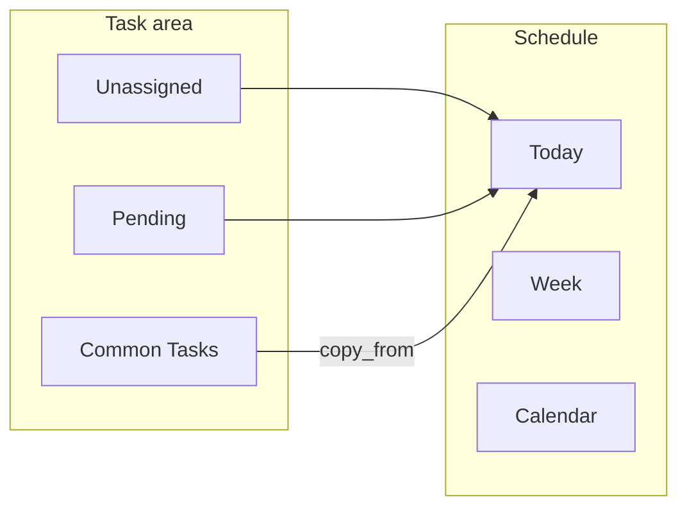

## Day Tracker – Software Requirements Specification (SRS)

### Executive summary (requirements)

Day Tracker shall provide **task management**, **multi-mode scheduling**, **completed-work history and summary**, optional **Smart Planning (AI)** assistance, and **user/admin configuration**, backed by **PHP APIs** and **SQLite** storage with a **Next.js** web client. This SRS states **testable “shall” requirements** for that behavior. **`docs/Application-Spec.md`** is the behavior/architecture companion; **`docs/DATABASE.md`** narrates database files and tables; **`contracts/schema.dbml`** is the schema contract. Managed templates **`docs/PRD.md`**, **`docs/FUNCTIONAL_SPEC.md`**, **`docs/TECHNICAL_DESIGN.md`**, and **`docs/EXPERIENCE_DESIGN.md`** are placeholders for a future **split documentation** pipeline—requirements here remain authoritative until those documents are fully merged from fragments.

---

### 1. Introduction

#### 1.1 Purpose

The purpose of this Software Requirements Specification (SRS) is to define, in a precise and testable way, the functional and non-functional requirements for the **Day Tracker** application.

This SRS complements:
- `docs/Application-Spec.md` – which describes **current** behavior and architecture (including UX hierarchy, workflows, and folder structure).
- `docs/DATABASE.md` – database files, tables, and migration rules.
- `docs/UI_IDENTIFIERS.md` – stable **`dt-*`** UI hooks (ids/classes) and **`data-dt-*`** conventions for the web client.
- `contracts/schema.dbml` – which defines the **database schema contract**.

Where there is a discrepancy between implementation and this SRS, the SRS describes the **intended** behavior the system should converge to.

#### 1.2 Scope

Day Tracker is a personal productivity application that combines:
- Task management (tasks, subtasks, priorities, checklists, links).
- Daily scheduling (time-blocked schedule and month calendar).
- Organizational metadata (categories, subcategories, tags).
- Integration with external calendars via iCal feeds.
- Optional AI assistance for planning.

It is a browser-based app backed by PHP APIs and SQLite databases (master + per-user).

This SRS covers:
- All user-facing behavior (UI flows, interactions, constraints).
- All API-level behavior for the public PHP endpoints.
- Data model and persistence requirements (indirectly via references to `schema.dbml`).

It does **not** cover:
- Infrastructure/deployment details.
- Internal logging or metrics beyond what is needed for functional behavior.

#### 1.3 Definitions, acronyms, abbreviations

- **Task** – A unit of work tracked in the system (`tasks` table).
- **Task group member** – A task whose `parent_id` points to a **group root** (another task with `parent_id` null). The stacked list/schedule UX treats these as a group.
- **Subtask (legacy)** – Same `parent_id` mechanism; older or edge-case nesting may still appear, but the primary product model is **task groups**, not arbitrary deep trees.
- **Day record** – A row in `day_record` representing a specific calendar date.
- **Slot / Scheduled slot** – An entry in `scheduled_slots` that places a task on a specific day (and optionally time window).
- **List state** – One of `unassigned` or `pending`, indicating which list a task appears in.
- **Common task (template)** – A root task flagged with `is_common` that appears in the **Common Tasks** section only. Scheduling or copying it into Unassigned/Pending creates a **new** normal task via `copy_from`; the template row itself is not placed on the schedule.
- **List style** – One of `bullet` or `checklist`, indicating how `task_list_items` for a task behave and render.
- **Organization data** – Categories, subcategories, and tags associated with tasks (tables: `task_categories`, `task_subcategories`, `task_tags`, and join tables).
- **iCal feed / subscription** – An external calendar feed URL that the app pulls events from.
- **Demo account** – Special account (`username = demo`) with a resettable, seeded database.
- **Master DB** – Shared SQLite DB storing users, SSO accounts, and global settings.
- **User DB** – Per-user SQLite DB (one per application user).

#### 1.4 References

- Application Specification: `docs/Application-Spec.md`
- Database documentation: `docs/DATABASE.md`
- Database schema: `contracts/schema.dbml`
- Product backlog: [`docs/BACKLOG.md`](BACKLOG.md)

#### 1.5 Documentation hierarchy vs. this SRS

The following mapping ties **product areas** in `Application-Spec.md` to **SRS clause groups** (normative):

| Product area (Spec) | SRS primary clauses |
|---------------------|---------------------|
| Task area (lists, search, order, templates, groups) | §3.2, §3.3 |
| Schedule (Today / Week / Calendar), iCal display | §3.4, §3.6.1 |
| Completed + summary | §3.5 |
| Smart Planning | §3.8 |
| User / Admin / Login | §3.7, §3.1 |
| Demo | §3.9 |

---

### 2. Overall description

#### 2.1 Product perspective

The system consists of:
- A Next.js 14 frontend (`app/`, `components/`) running in the user’s browser.
- A PHP API layer (`api/*.php`) that exposes JSON endpoints and a tokenized iCal feed.
- A master SQLite database and per-user SQLite databases (see `contracts/schema.dbml` and `migrations/*.sql`).
- External iCal feeds (e.g. Google Calendar) consumed via HTTP.

#### 2.2 Product functions (high level)

The system shall:
- Allow users to register, log in, and manage their own tasks and schedules.
- Provide a **demo account** for try-before-signup, seeded with representative data.
- Let users create, edit, and delete tasks, **task groups**, checklists, and links.
- Support **Common Tasks** (reusable templates) with copy-on-schedule semantics.
- Support organizing tasks by category, subcategory, and tags.
- Provide a **Today** time-blocked view and a **Calendar** month view of scheduled tasks and external events.
- Track task completion and present a **Completed** view grouped by date.
- Integrate with external calendars via iCal subscriptions and a user’s own outbound calendar feed.
- Allow administrative control over global settings (e.g. AI, iCal sync).
- Optionally allow users to use a **Smart Planning** (AI) panel for structured planning proposals, thread history, and apply-to-tasks/slots workflows (see §3.8).

#### 2.3 User characteristics

- **Standard user** – Manages their own tasks/schedule; may configure iCal subscriptions and personal settings.
- **Admin user** – Standard capabilities plus access to global settings and diagnostic tools.
- **Demo user** – Anonymous trial user accessing a shared `demo` account that resets regularly.

#### 2.4 Constraints

- The client is a browser; UI must be usable on both desktop and mobile.
- Persistent storage is SQLite (for now); schema must remain compatible with `contracts/schema.dbml`.
- Demo account must remain safe and resettable; user data for non-demo accounts must be isolated per user.
- External calendar feeds may be slow, truncated, or unavailable; the system shall handle such failures gracefully.

#### 2.5 Assumptions and dependencies

- The environment can send HTTP(S) requests to external iCal feed URLs.
- Authentication sessions (cookie-based) are available and secure.
- File system access is available for SQLite DB files and any iCal backup files as configured.

#### 2.6 UX and presentation requirements

- The system shall present a **dark-themed** UI using shared CSS variables for background, surface, text, border, and **accent** colors (see `Application-Spec.md` §3).
- The system shall use **system UI fonts** for body text unless otherwise specified.
- The system shall provide **priority** and **schedule** visual cues consistent across list and schedule (colors/icons).
- The system shall support **mobile** horizontal panel navigation and **desktop** multi-column schedule (**Week**) as described in `Application-Spec.md` §10–11.
- The system shall highlight the **current local calendar day** in **Calendar** and **Week** views with the **same accent border treatment** (see §3.4.2).

#### 2.7 Workflow requirements (reference diagrams)

The system shall support the end-to-end flows summarized in `Application-Spec.md` §4 (authentication, task→schedule, Smart Planning apply, iCal sync). **Mermaid diagrams** in that section are **informative**; testable behavior is stated in §3 below.

#### 2.8 Architecture and deployment constraints

- The system shall be deployable as a **static Next.js export** plus **PHP** endpoints copied alongside it (`release/` layout per `scripts/pack-next.cjs`).
- The system shall support **initial installation** via browser-driven **`install.php`** creating master SQLite and configuration (see `Application-Spec.md` §7).
- The system shall store **secrets** (OpenAI key, OAuth client secrets) in server config (`config.php`), not in client bundles.
- The system shall separate **master** and **per-user** SQLite databases as described in `docs/DATABASE.md`.

---

### 3. Specific requirements

Each subsection below states requirements in the form “The system shall …”. Where needed, we reference:
- **APIs**: `api/*.php`
- **Components**: `components/*.tsx`
- **Schema**: `contracts/schema.dbml`

#### 3.1 Authentication & accounts

- The system shall provide APIs for:
  - Fetching current user info (`GET /api/auth.php?action=me`).
  - Logging in, registering, and logging out (`POST /api/auth.php?action=login|register|logout`).
- The system shall sanitize usernames to `[a-zA-Z0-9_-]` and reject empty or invalid usernames.
- The system shall:
  - Store user credentials and DB mapping in the master DB (`users` table).
  - For non-demo users, create and migrate a dedicated **user DB** on first login/registration.
- The system shall treat the `demo` username as a special-cased demo account:
  - Registration with username `demo` shall be rejected.
  - Logging in as `demo` shall:
    - Ensure the demo user and DB exist (via `ensureDemoUserExists`).
    - Reset the demo DB to its seeded state (via `resetDemoUser`).
    - Record the last reset date and avoid re-resetting more than once per calendar day for normal API calls (see `api/common.php`).
  - Logging out as `demo` shall trigger another reset so the next visitor sees a clean state.
- The system shall support single sign-on (SSO) accounts (`sso_accounts` table) linked to master users and:
  - Allow linking an SSO provider (e.g. Google, Outlook).
  - Allow disconnecting SSO (where implemented) only when the user provides a valid replacement password.
- The system shall control admin access via the `users.is_admin` flag and shall reject non-admin requests to `api/admin.php`.

#### 3.2 Tasks and lists

##### 3.2.1 Task creation, editing, deletion

- The system shall allow users to create tasks with at least:
  - `title` (required, non-empty).
  - Optional `priority` (`commitment`, `high`, `medium`, `low`).
  - Optional `recurring` flag.
  - Optional `parent_id` (subtask of another task).
  - Optional `list_style` (`bullet` or `checklist`).
- The system shall default:
  - `priority` to `medium` when omitted or invalid.
  - `list_state` to `unassigned`.
  - `list_style` to `bullet`.
- The system shall allow editing:
  - `title`, `priority`, `recurring`, `recurrence_rule`, `parent_id`, `list_state`, and `list_style`.
- The system shall allow deleting any task, and shall:
  - Cascade deletes to related links (`task_links`), list items (`task_list_items`), scheduled slots (`scheduled_slots`), and organization join rows (`task_category`, `task_subcategory`, `task_tag`).
- In the task list view, the “New task” text input shall use the same font size as the task title text in each task row (shared token `--task-title-font-size`).

##### 3.2.2 Priority semantics

- The system shall treat:
  - `commitment` as the highest-priority, visually distinct category.
  - `high`, `medium`, and `low` as descending priorities with appropriate visual cues (colors/icons).
- The system shall allow sorting task lists by priority in both ascending and descending order.

##### 3.2.3 List states

- The system shall support at least two explicit list states stored on tasks:
  - `unassigned` – default list where new tasks appear.
  - `pending` – list for tasks the user has chosen to defer.
- The system shall:
  - Provide views and filters for `unassigned` and `pending` tasks.
  - Allow moving tasks between `unassigned` and `pending` via UI actions (drag/drop or controls), updating `list_state` accordingly.
- The system shall **not** introduce additional list_state values without updating both `schema.dbml` and this SRS.

##### 3.2.4 List styles & checklists

- The system shall support two list styles per task:
  - `bullet` – `task_list_items` act as unordered bullet points; `completed` may be ignored visually.
  - `checklist` – `task_list_items` act as checklist items with a visible checkbox; `completed` affects styling and may influence completion logic.
- For checklist tasks, the system shall:
  - Allow toggling `completed` on individual `task_list_items`.
  - Render completed items with a visible checkmark and dimmed, strike-through text.
  - Preserve completion state across reloads (persisted in the DB).

##### 3.2.5 Task groups (`parent_id`)

- The system shall represent **task groups** via `tasks.parent_id`:
  - A **group root** has `parent_id` null; **members** have `parent_id` equal to the root’s id.
  - In the **task list**, members are shown **stacked** under the root with shared group actions (priority, schedule, ungroup, delete) and **`group_order`** for sibling ordering.
- In the **schedule** view, a root with direct children is a **task group**:
  - The schedule renders the parent as the group root and the direct children as stacked member blocks.
  - The group root slot spans the full group duration, and member blocks are distributed sequentially within that duration.
  - Group-aware resizing/moving updates `start_time`/`end_time` for all member blocks together, while preserving the group duration constraints (including minimum group duration) and step snapping.
  - Group root priority edits apply to its direct members, and ungrouping clears `parent_id` for those descendants to move them back into the root task list.
- When deleting a group root, the system shall delete or cascade members per schema (`ON DELETE CASCADE` on `parent_id` where applicable).
- Legacy deeply nested rows (if any) shall still render without breaking list or schedule rules.

##### 3.2.6 Search

- The system shall provide a task search input that:
  - Filters the visible list of tasks by matching:
    - Task title.
    - Link description and URL (`task_links`).
    - List item content (`task_list_items`).
  - Applies in a case-insensitive manner.
- In the task list view UI, the search input shall be placed on the same row as the `Order by` controls, positioned to the right of the `Order by` select.
- The search input styling shall match the “New task” input styling for consistent sizing/typography.
- The system shall respond to search changes without requiring a full page reload.
- The same search input shall filter **Common Tasks** templates (title, links, list items) when that section is visible.

##### 3.2.7 Common tasks (templates)

- The system shall persist a per-task **`is_common`** flag on `tasks` (see `contracts/schema.dbml` and migration `020_tasks_is_common.sql`).
- A common task shall be a **root** task only (`parent_id` null). The system shall reject marking a subtask or a group root that has child tasks as common (API and UI constraints).
- Common tasks shall **not** appear in the **Unassigned** or **Pending** list columns:
  - List APIs with `list_state` shall exclude rows where `is_common` is set.
  - The client shall not show `is_common` tasks in those columns even if data were inconsistent.
- The task view shall include a **Common Tasks** section that:
  - Lists all common (template) root tasks.
  - Provides a dedicated input to create new templates (same creation flow as normal tasks but with `is_common` true).
  - Renders template task cards with a **distinct visual cue** (e.g. orange border) so they are not confused with normal list tasks.
- **Copy semantics** (the template row is never scheduled or moved as a normal list row):
  - Dragging a template to **Unassigned** or **Pending** shall create a new task via **`copy_from`** with the target `list_state`, then refresh data.
  - Dragging a template onto the **schedule** (timed or untimed drop zones) or onto a **calendar day** shall create a **`copy_from`** task first, then create slots for the **new** task id(s) (not the template id).
  - Using **Schedule on a date** from a template shall copy first, then apply `due_date`, priority bump (if chosen), and slot creation to the **copy**.
  - **To Pending** / **To Unassigned** actions on a template card shall use **`copy_from`** into the corresponding `list_state`.
  - Dropping a template onto another task to **group** it shall copy the template, then set `parent_id` on the new copy to the effective group root.
- **`copy_from` behavior** shall duplicate at least: title, priority (non-recurring copy), `list_style`, links, list items, and organization fields onto a new non-common root; recurrence on the copy shall be cleared as implemented in `api/tasks.php`.
- The system shall allow **removing** template status (**Not a template**) and **promoting** an eligible normal root task to a template (**Template**) via `PATCH` on `is_common`, subject to the root/no-children rules above.
- On **mobile**, the task list area shall present **Unassigned**, **Pending**, and **Common Tasks** as horizontally swipable panels (three columns) consistent with the existing mobile task-list swipe pattern.
- The system shall provide **Add to bucket** on favorite templates: a modal pre-filled from the template with the **first list bucket selected by default**, editable title and task metadata, and creation via **`copy_from`** plus field overrides.
- **Rollover and groups:** Incomplete group members shall **remain grouped** after their scheduled day passes. Only members with a **completed** slot on a past day shall be ungrouped on rollover. Scheduled groups with remaining incomplete work shall return to their source bucket while staying grouped.

##### 3.2.8 Default block and Auto Block

- Tasks may store **`default_block_id`** (FK to `task_blocks`) and **`default_duration_intervals`** (positive integer; one step = one schedule increment from user settings).
- These fields are used by **Auto Block** only; they do not otherwise affect list or schedule display.
- Task details shall allow clearing the default block (null) and setting duration in whole increment steps (minimum 1).
- Each list bucket header shall expose an **Auto Block** control (adjacent to hide-bucket) that opens a modal to populate **schedule block instances** on the **view date** for unscheduled tasks in that bucket that have a default block assigned.
- The modal shall offer sort order: added (oldest first, default), added (newest first), priority, due date (soonest first; tasks without due date last).
- Tasks without a default block, already scheduled on the view date, or that do not fit in a matching block’s remaining time shall be skipped.

##### 3.2.9 Schedule draft creation

- Clicking the schedule grid to add a task shall create a **local draft** only (no `tasks` or `scheduled_slots` row) until the user enters a non-empty title.
- While drafting, the UI shall focus the title field and disable other actions on that slot.
- Clicking away or discarding an empty title shall remove the draft without persisting.

##### 3.2.10 Task links (URLs, contact, maps)

- The system shall allow each task to have zero or more links (`task_links`: URL + optional description); URLs shall be unique per task.
- The **Link modal** shall accept:
  - Standard http(s) URLs.
  - Contact URLs (`mailto:`, `tel:`, `sms:`) and bare email addresses or phone numbers (normalized to contact URLs on save).
- The system shall **not** use HTML5 `type="url"` validation that rejects bare email addresses.
- **Contact links** shall:
  - Be detected and shown with contact glyphs (email, phone, SMS) in the task list, schedule, link modal, and completed summary.
  - Open using user preferences stored in **`app_settings.contact_link_json`** (GET/PATCH via `api/settings.php`): email handler (`mailto`, Gmail web compose, Outlook web, Yahoo web) and phone handler (`tel` vs `sms`), with optional Gmail multi-account slot index (`/u/0/` … `/u/5/`).
  - On mobile, prefer native mail/phone handlers for contact links when opening from the task UI.
- **Map links** shall:
  - Be detected for recognized map provider URLs and `geo:` / native map app schemes.
  - Display a map glyph distinct from generic chain links.
  - Open using maps-aware handling (`lib/mapLinks.ts` integrated via `lib/taskLinks.ts`).

#### 3.3 Organization (categories, subcategories, tags)

##### 3.3.1 Data model

- The system shall:
  - Allow zero or one category per task (`task_category`).
  - Allow zero or one subcategory per task (`task_subcategory`).
  - Allow zero or more tags per task (`task_tag`).
- A subcategory shall always belong to a category, and the system shall enforce that:
  - A subcategory cannot be created without a valid `category_id`.
  - A subcategory should only be assignable to tasks that also have the corresponding category (or the system shall ensure consistency on the backend).

##### 3.3.2 Category, subcategory, tag management

- The system shall provide CRUD operations via `api/organization.php` for:
  - Categories (`task_categories`).
  - Subcategories (`task_subcategories`).
  - Tags (`task_tags`).
- The system shall:
  - Require a non-empty `name` for all these entities.
  - Optionally accept a `color` string (CSS-compatible) for categories and tags.
- For tags:
  - If no `color` is provided on creation, the system shall assign a random color within a visually-appealing range (e.g. HSL with a fixed saturation/lightness).

##### 3.3.3 Assignment and display

- The system shall allow assigning:
  - A category and optional subcategory to a task.
  - An arbitrary set of tags to a task.
- In the **task list** view, the system shall:
  - Display category and subcategory beneath the task description in a font similar to the created-at date.
  - Display tags to the right of the task description as pill-shaped badges.
  - For **task groups** (stacked root and members), display each segment’s category, subcategory, and tags the same way as for standalone tasks (per member row).
- In the **schedule** view, the system shall:
  - Use category colors as background or accents for scheduled blocks when applicable.
  - Display category/subcategory beneath the scheduled task title within each slot.
  - Display tags as pill-shaped elements within the slot, ensuring text and categories remain legible within a single schedule interval (even when font size must shrink slightly).
  - For **task groups**, display tags on the group root row and on each member’s slice; in **Week** view compact blocks, show the root task’s tags in the block header when space allows.

#### 3.4 Schedule & calendar

##### 3.4.1 Day (Today) view

- The system shall:
  - Use **local** calendar **YYYY-MM-DD** strings for the viewed day and for prev/next day navigation in the web client so the correct `day_record` and scheduled slots are requested in every time zone (not UTC-derived days from `Date.toISOString()` alone).
  - Render a vertical hourly grid from `start_hour` to `end_hour` (from user settings).
  - Subdivide the grid according to `increment_value` and `increment_unit`.
  - Allow horizontal and vertical scrolling as needed.
  - On mobile, render the slot completion control as a circular outline with the checkmark visually hidden when the slot is incomplete, and visible when the slot is completed (via `aria-pressed=true`).
  - When scheduling a task on a specific date, the system shall set the task's `due_date` to that date.
  - If the user enables the "Increase priority automatically" option in the scheduling dialog, the system shall bump the task priority to `high` at scheduling time.
- The system shall ensure:
  - The end-range label (e.g. latest time) is fully visible and not clipped.

##### 3.4.2 Calendar view

- The system shall:
  - Render a month grid with weeks and days, starting at the first day of the month.
  - Show scheduled slots and iCal events in each day cell.
  - Distinguish visually between:
    - App tasks (slots) and external iCal events.
    - Completed vs incomplete tasks.
  - Highlight the **current local calendar day** (“today”) in the month grid with a distinct border using the theme **accent** color (and matching outer ring), so it is visually obvious which cell is today.
- In **Week** view (desktop, one time column per day in the selected range), the system shall highlight the column for the **current local calendar day** with the **same accent border treatment** as the “today” cell in the month **Calendar** view.
- Overlapping tasks and iCal events shall **not** visually occlude each other; the layout shall allow both to be visible (e.g. stacked or sharing vertical space).

##### 3.4.3 Drag-and-drop behavior

- The system shall support dragging:
  - Tasks from Unassigned or Pending lists into the schedule to create new slots.
  - **Common Tasks** templates into the schedule or calendar: the system shall instantiate a **`copy_from`** task (or tasks) first, then create slots for the new instance(s), leaving the template unchanged.
  - Scheduled slots within a day to change time or across days (in calendar).
- When dragging near the left or right edge of the schedule or calendar:
  - The system **may** auto-advance the visible date (or week) after a small hover delay to allow cross-day drops (this behavior is planned; see [`BACKLOG.md`](BACKLOG.md) — edge drag).
- Partial completion (yesterday’s group slots):
  - Root tasks that had mixed completed/incomplete member slots on the previous day shall appear in **Unassigned** or **Pending** according to `list_state` (not in a separate list column).
  - When moving such a root between Unassigned and Pending (or when removing it from the schedule), the system shall apply the same orphan / slot-resolution rules as for other partially completed groups (e.g. confirmation and slot cleanup).
- Other list rules:
  - Moving a completed subtask out of a parent shall:
    - Optionally prompt for archiving.
    - If the parent has no more completed subtasks, automatically move the parent to `pending`.
- Task groups in schedule drag/resize:
  - When a group root (a task with direct children) is scheduled or manipulated in the schedule view, the system shall update all direct member blocks together.
  - The system shall preserve the group root's total duration and redistribute member block times sequentially within that duration.
  - The system shall clamp resize operations so the group cannot be resized below its minimum duration derived from member count and scheduling increments.

##### 3.4.4 Recurring tasks

- The system shall:
  - Represent recurring tasks using `tasks.recurring` (flag) and optional `recurrence_rule` (JSON, see `schema.dbml`).
  - Generate recurring occurrences on demand for:
    - The “Today” schedule view (`api/slots.php` virtual occurrences).
    - The date-range schedule API for calendar or AI context.
- Recurring start-date semantics:
  - A recurring task has a stable series start date based on when it was created (compatible with how calendar exports like iCal represent repeating events).
- Omitted dates / exceptions:
  - Recurring tasks may have omitted dates (exceptions) when a user applies “this occurrence only” edits or removals on the current date or future dates.
  - The system must ensure omitted dates do not continue to appear as virtual occurrences for the recurring series.
- When a user changes the time or date of a recurring task’s scheduled slot, the system shall:
  - Present a dialog that supports the following cases:
    - **Case 1 (all future)** – Change all future recurring tasks:
      - If the affected day is the current date, update the original recurring series.
      - If the affected day is in the future, create a new recurring series with the modifications and stop the original series at the change boundary.
    - **Case 2 (this occurrence only)** – Change just this one:
      - If accepted, create a non-recurring replacement task for that specific day.
      - Ensure the original recurring series omits that specific day so it does not also appear as a virtual occurrence.
    - **Convert to one-off** – break this occurrence out as a separate non-recurring task (if applicable for the chosen edit).
  - Avoid silently changing the recurrence pattern (i.e. behave “pessimistically” rather than optimistically).
- When deleting a recurring task or its slots, the system shall:
  - Provide clear options when removing “all instances” vs a single occurrence.
  - Ensure deleting “all instances” fully removes the recurring series (and does not move it back to a default list_state).
  - Ensure the “all instances” delete behavior is consistent for normal tasks (i.e. it should fully delete as well, not move them back to assigned/pending).

##### 3.4.5 Partial completion detection (yesterday)

- The system shall identify root tasks that had **partial** completion on yesterday’s schedule (for orphan handling and list placement), using:
  - Yesterday’s scheduled slots and their `completed` flags.
  - Parent/child slot relationships (subtasks) and rules aligned with `api/tasks.php` (`view=incomplete` + `day`).
- A root qualifies when, for yesterday, it has at least one completed and at least one incomplete member slot (group case), excluding all-done and none-done groups.
- The UI shall **not** expose a dedicated “Incomplete” task list section; those roots are shown only under Unassigned or Pending.

#### 3.5 Completed tasks & history

- The system shall:
  - Maintain a **Completed** panel showing tasks completed on each day, primarily from **`scheduled_slots`** (completed flag and day boundaries), with accomplished-style listings where implemented.
  - On open, load completed data for the panel (e.g. `list_all` / accomplished APIs) so the drawer can show content without stale empties.
  - Group completed items by `date`, with the most recent dates first.
  - Provide a **summary** affordance (e.g. modal) aggregating completed work for a chosen scope, as implemented in `CompletedPanel` / `api/accomplished.php` (`summary_org`).
  - For the **Time by category** summary modal, the system shall:
    - Support an optional **date range** query for the rollup.
    - Show each task’s **tags** next to its title (or include tag names when titles are shown comma-separated), using tag data returned by the API.
    - Provide a **search** control that filters the displayed rollup by task title, tag name, category, or subcategory without requiring a new server request.
    - Provide **Export** (tab-delimited `.tsv` for Excel/Sheets) and **Table** (same columns in an in-app spreadsheet modal, with optional **Open in new tab**) for the currently filtered summary.
  - Display:
    - Title.
    - Optional derived duration (based on start/end times).
    - Optional grouped members completed under a task where applicable.
- The Completed view shall treat external iCal events with `user_completed = 1` appropriately (e.g. show them or keep them separate, as product decisions dictate).
- *Planned UX refinement:* initial window of recent days, infinite scroll loading older chunks, and removal of redundant close chrome — see [`BACKLOG.md`](BACKLOG.md).

#### 3.6 iCal integration

##### 3.6.1 External subscriptions (current behavior)

- The system shall:
  - Allow users to add one or more external iCal subscriptions (`ical_subscriptions`) via Settings → Subscriptions.
  - Validate that feed URLs are non-empty and attempt to fetch them using a browser-like User-Agent.
  - Store fetched events per subscription in `ical_feed_events`, expanding recurring events into individual occurrences.
  - Respect `enabled` flag and `last_synced_at` for subscriptions, and allow syncing within an admin-configured date range and interval.
- The system shall:
  - Provide an “Excluded iCal events” interface that:
    - Lists excluded UIDs and titles (from `ical_excluded_events`).
    - Allows adding new UIDs to exclude, updating `app_settings.ical_omit_uids`.
    - Allows removing UIDs from the exclusion list, so they show again.

##### 3.6.2 Outbound calendar feed & mutual sync (future / planned)

- The system shall provide a tokenized outbound iCal feed URL per user:
  - Using `ical_feed_tokens.user_id/token`.
  - Accessible from User Settings → Subscriptions.
  - Representing the user’s own scheduled tasks (`scheduled_slots`) as VEVENTs.
- For **full mutual sync** beyond the outbound feed, the system shall:
  - Support at least one of:
    - **Option A (preferred baseline)**: Publish an iCal feed that Google can subscribe to (“Add by URL”), so Day Tracker tasks appear in Google Calendar.
    - **Option B**: Use Google Calendar API with OAuth to push changes directly into a selected Google calendar.
  - Provide a strategy to avoid duplicate read-back of its own events:
    - Option 1: Use a dedicated “Day Tracker” calendar only for app-created events and not subscribe to that same calendar.
    - Option 2: Tag app-created events (UID prefix or X-PROP) and filter/dedupe them when reading back events into the app.

#### 3.7 User & admin settings

##### 3.7.1 User settings

- The system shall structure user settings into:
  - **Profile**:
    - Display username and SSO accounts.
    - Allow password change for non-demo users.
  - **Subscriptions**:
    - Show outbound calendar feed URL with copy-to-clipboard.
    - Allow adding/removing external iCal URLs.
    - Allow managing excluded iCal events.
  - **Schedule Settings**:
    - Allow editing of `start_hour`, `end_hour`, `increment_value`, `increment_unit`, and `timezone`.
  - **Organization**:
    - Allow viewing and editing categories, subcategories, and tags, including colors.
- The system shall:
  - Only allow demo password or SSO changes where explicitly permitted (currently not allowed for demo).

##### 3.7.2 Admin settings

- The system shall provide an admin settings UI for:
  - Toggling global `debug` mode.
  - Toggling global `ai_enabled`.
  - Configuring iCal fetch timeout, event range days, and sync interval minutes.
  - Configuring whether to run iCal sync in the background (interval fetch) and whether to save last fetch files.
  - Viewing:
    - Last iCal fetch state and optionally parsed events.
    - Recent error log lines from the server.
  - Listing users and their basic metadata (username, db_name, flags, created_at, SSO providers).

##### 3.7.3 Login screen

- The system shall provide a **login** screen allowing:
  - **Username + password** authentication for existing users.
  - **Registration** of new accounts (where enabled), with validation consistent with `api/auth.php` (e.g. minimum password length).
  - Switching between login and register forms without a full page reload.
  - Display of server error messages when authentication fails.
- The system shall expose **SSO entry points** (e.g. provider-named links) that route into `api/auth.php` OAuth flows when configured.
- **SSO product completeness** (all desired identity flows, edge-case messaging, and provider matrix) shall continue to **evolve**; requirements in §3.1 for `sso_accounts` and password/SSO linking remain authoritative for data model behavior. *Implementation note:* treat extended SSO scenarios as **roadmap** until explicitly closed in backlog.

#### 3.8 Smart Planning (AI assistant)

> **Documentation:** Core Smart Planning requirements are specified below. Additional narrative UX, detailed error budgets, and multi-provider AI configuration shall be expanded in **`docs/FUNCTIONAL_SPEC.md`** / **`docs/TECHNICAL_DESIGN.md`** when those managed documents are populated from fragments; **`docs/PRD.md`** carries product-level outcomes.

- The system shall:
  - Provide a right-hand **Smart Planning** panel (`AIPanel`) that can be collapsed/expanded and resized horizontally, with thread transcript and **New chat**.
  - Persist **AI threads** in a per-user **`*_ai.sqlite`** database via `api/ai/threads.php` (list, get, create, append message rows, delete).
  - Persist assistant/user payloads with server-side size caps; truncation behavior shall preserve transcript usability and Apply-critical envelope data.
  - Store only **`daytracker_ai_active_thread_id`** in `localStorage` (not full transcripts).
  - Allow the user to enter a freeform message; send to **`POST api/chat.php`** with:
    - `message`, `viewDate`, `contextOptions`, client-built **`taskContext`**, optional **`contextFragments`**, optional **`threadId`** and **`threadHistoryMax`**.
  - When **`useServerContext`** is enabled, merge a **server-built `taskContext`** (tasks, slots, accomplished, schedule settings, optional iCal slice, organization catalog) with the client payload, **server keys overriding** duplicates.
  - Load prior turns from the thread into the model request as user text plus assistant **summaries**, skipping a duplicate trailing user row that matches the current message.
- The assistant response shall be a **single JSON object** (see `contracts/ai/assistant-response.schema.json` and the API overview in `docs/Application-Spec.md`) with at least:
  - `kind`, `advice`, optional `dataRequests`, `proposals`, optional `proposedOrgCreates`, `clientHints`.
- The system shall:
  - When the model returns **`dataRequests`**, let the user pick rows and call **`api/ai/context_resolve.php`** to obtain **`contextFragments`** for a follow-up chat.
  - Render **`advice`** and editable **flattened proposals**; **Apply** shall execute `applyAiAssistantPlan` (`lib/aiApply.ts`): resolve `proposedOrgCreates` (categories → subcategories → tags), create/update tasks, links, list items, organization joins, and slots; apply **`newTagSuggestions`** via find-or-create; stop on first apply error and refresh state after reporting the failure.
  - When proposals include slot times, offer **Preview schedule** (`SchedulePreviewGrid`); **Accept** shall gate Apply; **Reject** shall dismiss the preview only.
  - Respect master **`ai_enabled`** and surface it via `auth.php?action=me`; when disabled, the panel shall not send chat requests.
  - Use last-write-wins semantics for concurrent thread writes in v1; conflict UI is optional future work.
  - Use the OpenAI key from **`config.php`** (`openai_api_key`) on the server; the client shall not receive full secrets.
- *Planned:* Anthropic/Claude via Vercel, admin-editable install-time settings, masked key tails — see [`BACKLOG.md`](BACKLOG.md).

#### 3.9 Demo account behavior

- On any day the demo user first uses the app, the system shall:
  - Ensure migrations are applied to the demo DB.
  - Seed demo data (tasks, **task groups** where applicable, **Common Tasks** templates, slots, links, list items, organization) as described in `lib/demo_seed.php` and summarized in `docs/Application-Spec.md`.
  - Reset **`demo_ai.sqlite`** when present so AI threads do not leak between demo sessions.
  - Generate a fresh iCal feed token for the demo user.
- The system shall:
  - Prevent the demo user from changing the account password.
  - Treat all demo changes as ephemeral; a reset may remove them at the next daily reset.

#### 3.10 Non-functional requirements

##### 3.10.1 Usability

- The system shall be usable on both desktop and mobile:
  - On mobile, panels shall be swipeable horizontally.
  - On mobile, complex controls (e.g. schedule function icons) may be consolidated into a drawer; that drawer shall:
    - Use a triangle icon (not “<”/“>”) per TODO feedback.
    - Appear to the left of the button and float above, not be clipped inside the task container.
  - On desktop, when too many function icons exist for a slot, the UI may switch to a drawer pattern similar to mobile.

##### 3.10.2 Reliability & data integrity

- The system shall:
  - Run database migrations on first access to a user DB and avoid running the same migration multiple times.
  - Include a data-integrity check helper (`lib/data_integrity.php`) and use it before/after key operations where configured.
  - Handle missing optional tables (e.g. organization or iCal-related tables) gracefully, returning empty sets instead of failing.

##### 3.10.3 Performance

- The system shall:
  - Load the Today view (tasks + schedule + external events) within a reasonable time on a standard connection (e.g. < 2–3 seconds under normal load).
  - Perform iCal sync in the background where possible, with intervals configured via admin settings, to avoid blocking main UI actions.

##### 3.10.4 Security

- The system shall:
  - Require authentication (session) for all API endpoints except those explicitly meant for auth/SSO and public feeds.
  - Restrict admin endpoints to users with `is_admin = 1`.
  - Protect the demo account from registration misuse and enforce its special behaviors.
  - Treat iCal feed tokens as secrets:
    - Use unguessable random values.
    - Allow regenerating tokens (invalidating old URLs) via user or admin action (demo reset does this automatically).

---

### 4. Traceability to code and DBML

For each major requirement area:

- **Authentication & accounts**:
  - APIs: `api/auth.php`, `api/user.php`, `api/common.php`.
  - Schema: `users`, `sso_accounts`, `master_app_settings` in `contracts/schema.dbml`.
  - UI: `components/MainApp.tsx`, `components/LoginScreen.tsx`, `components/UserSettingsView.tsx`.

- **Tasks and lists**:
  - APIs: `api/tasks.php` (including `GET ?common=1`, `POST` with `is_common` / `copy_from`, `PATCH` `is_common`), `api/task_list_items.php`, `api/links.php`.
  - Schema: `tasks` (including `is_common`), `task_list_items`, `task_links` in `contracts/schema.dbml`; migration `020_tasks_is_common.sql`.
  - Client: `lib/api.ts` task types and `tasks.list` / `tasks.create` / `tasks.update`.
  - Tests: `tests/Api/TasksApiTest.php` (e.g. common list, `copy_from`, `is_common`); `components/TaskListAndSchedule.test.tsx` (regression).
  - UI: `components/TaskListAndSchedule.tsx`, `components/TaskListItemsModal.tsx`, `components/LinkModal.tsx`.

- **Organization**:
  - APIs: `api/organization.php`.
  - Schema: `task_categories`, `task_subcategories`, `task_tags`, `task_category`, `task_subcategory`, `task_tag`.
  - UI: `components/TaskListAndSchedule.tsx`, `components/UserSettingsView.tsx`.

- **Schedule & calendar / Completed**:
  - APIs: `api/slots.php`, `api/accomplished.php`, `api/day.php`, `api/rollover.php`.
  - Schema: `day_record`, `scheduled_slots`.
  - UI: `components/TaskListAndSchedule.tsx`, `components/CompletedPanel.tsx`.

- **iCal integration**:
  - APIs: `api/ical_subscriptions.php`, `api/ical_events.php`, `api/ical_excluded.php`, `api/ical.php`, `api/admin.php` (settings).
  - Schema: `ical_subscriptions`, `ical_feed_events`, `ical_excluded_events`, `master_app_settings`.
  - UI: `components/UserSettingsView.tsx`, `components/AdminSettingsView.tsx`.

- **Smart Planning (AI)**:
  - APIs: `api/chat.php`, `api/ai/threads.php`, `api/ai/context_resolve.php`; helpers under `lib/ai_*.php`, `lib/aiApply.ts`, `lib/aiTypes.ts`.
  - Schema: per-user `*_ai.sqlite` + `migrations_ai/` (threads/messages).
  - Contracts: `contracts/ai/assistant-response.schema.json`.
  - UI: `components/AIPanel.tsx`, `components/SchedulePreviewGrid.tsx` (or equivalent preview modal).

- **Demo behavior**:
  - Code: `lib/demo_seed.php`, demo-specific branches in `api/auth.php` and `api/common.php`.

These references should be updated if files are renamed or responsibilities move. Any schema change must be reflected in `contracts/schema.dbml`, **`docs/DATABASE.md`**, and, where relevant, in this SRS and `docs/Application-Spec.md`.

---

### 5. Software design coverage

The following standard design topics are addressed across **`Application-Spec.md`**, this SRS, and **`docs/DATABASE.md`**:

| Topic | Where addressed |
|-------|-----------------|
| UX structure & panel flow | Application-Spec §2–4, §10–14; SRS §2.6–2.7 |
| UI tokens (color, type) | Application-Spec §3; SRS §2.6 |
| Workflows | Application-Spec §4 (Mermaid); SRS §2.7 |
| Architecture & folder layout | Application-Spec §5–6; SRS §2.8 |
| Server install & config | Application-Spec §7; SRS §2.8 |
| Persistence & schema | DATABASE.md, schema.dbml; SRS §3 (behavioral), traceability §4 |
| API contracts (AI JSON) | Application-Spec §15; SRS §3.8; `contracts/ai/` |
| Testing & quality gates | SRS §3.10; `tests/`, `e2e/`, Vitest in repo |

Items intentionally **out of scope** for these three files but reserved for split templates: **commercial roadmap sequencing** (PRD), **detailed logical flows only** (FUNCTIONAL_SPEC), **experience principles-only** (EXPERIENCE_DESIGN), **deep technical alternatives** (TECHNICAL_DESIGN)—see respective template stubs under `docs/`.

---

## 6. Mobile gestures and modes (locked behavior)

This section locks the mobile gesture vocabulary and the mode state machine that
ships in the active rebuild (`.apm/_WORKSPACE/TODO-mobile.md §0` is the working
spec; this is the published summary).

### 6.1 Gesture dictionary

The mobile UI recognizes only the following gestures. Anything else is ignored.

| Gesture     | Trigger                                                      | Used for                                                       |
|-------------|--------------------------------------------------------------|----------------------------------------------------------------|
| Tap         | Single quick touch (< 50 px / < 300 ms)                      | Buttons, tabs, drop-in-slot, Cancel banner                     |
| Double Tap  | Two taps within 300 ms and 24 px                             | Inline title edit; in Move mode → group / ungroup / exit       |
| Long Press  | Hold ≥ 400 ms with movement < 24 px                          | Enter Move mode on the held task                               |
| Swipe Left  | Movement > 50 px **or** velocity > 0.3 px/ms, horizontal     | Next bucket; Today → Calendar tab                              |
| Swipe Right | Same threshold, opposite axis                                | Previous bucket; Calendar → Today tab                          |
| Swipe Up    | Same threshold, vertical                                     | Scroll (passes through; never consumed by mode handlers)       |
| Swipe Down  | Same threshold, vertical                                     | Scroll (passes through; never consumed by mode handlers)       |
| Pinch       | —                                                            | **Not used** (reserved)                                        |
| Zoom        | —                                                            | **Not used** (reserved)                                        |
| Rotate      | —                                                            | **Not used** (reserved)                                        |

Precedence within a single pointer interaction: **Swipe > Double Tap > Long Press > Tap**.
The recognizer fires at most one gesture per pointer down/up cycle.

### 6.2 Modes

The app maintains exactly one of these mobile modes at a time (managed by
`lib/mobileMode.ts`):

- **Normal** — default; all standard taps and swipes route to their feature handlers.
- **Move** — entered by Long Press on a task. The held task + group members are
  highlighted; Tap on a drop zone or time slot drops; Double Tap on the
  originating task exits; a sticky banner offers Cancel.
- **Resize** — entered by Tap on a 24 px edge strip of a scheduled task / block.
  Tap any valid interval commits; tap the same edge again cancels.
- **Edit** — inline title editor is focused.
- **BulkSelect** — multi-select toolbar is active.

In addition the provider tracks a **modal/drawer refcount** (`modalOpenCount`).
Whenever any modal or drawer registers itself (via `useModalGestureSuppression(open)`),
the gesture coordinator suppresses Tap, Double Tap, Long Press, and Swipe across
the whole app. This is the canonical "ModalOpen" condition.

### 6.3 Where gestures live in the code

| Concern                                    | Module                                              |
|--------------------------------------------|-----------------------------------------------------|
| Mode state machine + provider              | `lib/mobileMode.ts`                                 |
| Generic recognizer (per-element)           | `lib/mobileGestures.ts`                             |
| Task-list event-delegated recognizer       | `lib/useTaskListMobileGestures.ts`                  |
| Haptic feedback                            | `lib/mobileHaptics.ts`                              |
| Move banner / cancel button                | `components/mobile/MobileMoveBanner.tsx`            |
| Picker modal (replaces `<select>` on mobile) | `components/mobile/MobilePickerModal.tsx`         |
| Mobile-aware select wrapper                | `components/mobile/MobileAwareSelect.tsx`           |
| Debug overlay (admin debug only)           | `components/MobileModeDebugOverlay.tsx`             |
| Glance View toggle + CSS scaffold          | `components/TaskListAndSchedule.tsx`, `app/globals.css` |
| EOD auto-complete runner                   | `lib/eodAutoComplete.ts` (mounted in `MainApp.tsx`) |

