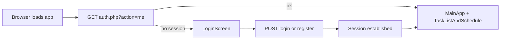
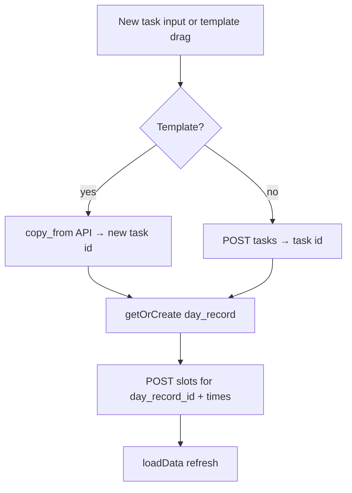
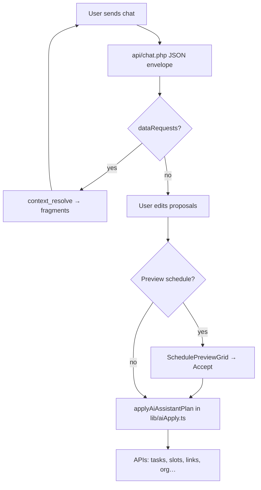
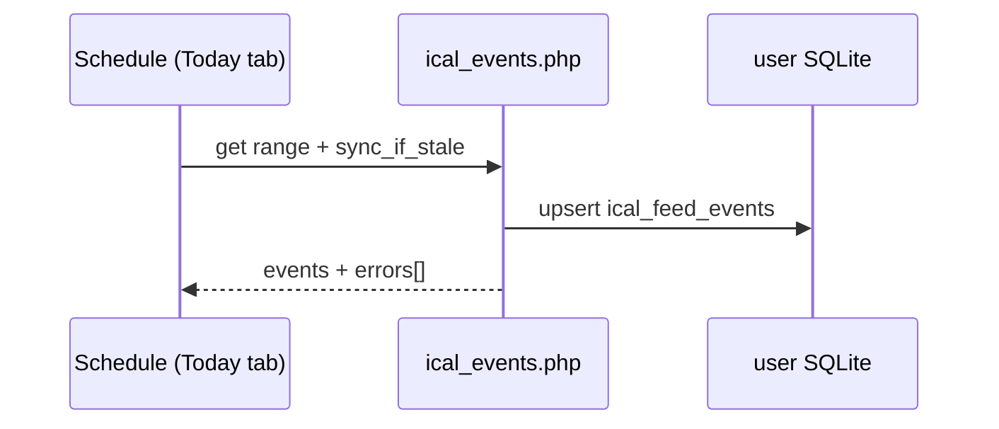
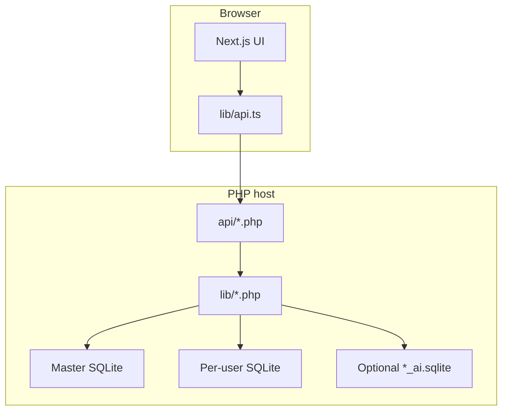

## Day Tracker – Application Specification

### Document map

| Audience | Use this spec for **current product behavior** and architecture. |
|----------|---------------------------------------------------------------------|
| Split docs | **`docs/PRD.md`**, **`docs/FUNCTIONAL_SPEC.md`**, **`docs/TECHNICAL_DESIGN.md`**, **`docs/EXPERIENCE_DESIGN.md`** are managed templates for future fragment-driven expansion; this file remains the **implementation-aligned** reference until those are fully populated. |
| Schema | **`docs/DATABASE.md`** (narrative DB overview), **`contracts/schema.dbml`** (contract). |
| UI hooks | **`docs/UI_IDENTIFIERS.md`** — stable `dt-*` ids/classes and `data-dt-*` for regions and automation. |
| SSO | **`docs/SSO_SETUP.md`** — Google / Microsoft OAuth, `config.php`, `base_url`, redirect URIs. |

---

### 1. Executive summary

**Day Tracker** is a browser-based personal productivity app: tasks (with templates, groups, links, checklists, and organization metadata), a multi-mode **schedule** (Today / Week / Calendar), **completed-work history** with analytics-style summary, optional **Smart Planning** (AI-assisted proposals and apply-to-schedule), and **settings** (user profile, subscriptions, schedule, organization, admin). The UI is a **Next.js 14** single-page app talking to **PHP** JSON APIs backed by **SQLite** (master + per-user DBs). This document describes what the shipped code does, how the UX is structured, and where files live—so engineering and product can align on **current** behavior and plan split documentation (PRD, functional spec, etc.) without losing traceability.

---

### 2. UX description

- **Mental model**: Users capture work as **tasks**, optionally organize them with **categories / subcategories / tags**, place them on a **day and time** (or leave them in **Unassigned** / **Pending**), and mark **completion** on the schedule or checklist. **Common Tasks** are reusable templates that **copy** into real tasks when scheduled or moved to a list. **Task groups** stack members under a root in both list and schedule.
- **Primary surfaces**: A **horizontal panel** strip—**Completed** (history), **Tasks + Schedule** (main), **Smart Planning** (AI)—with **mobile swipe** between panels. The task column and schedule share `TaskListAndSchedule`; settings and admin open as **modals** from the app bar.
- **Feedback**: Loading spinners use the accent color; iCal sync shows phase/status on the schedule header; errors surface as inline messages and `task-list-error` text. **Demo** account resets to a seeded state so trials are predictable.
- **Density**: Schedule blocks adapt **font scale** and **action drawer** patterns for narrow or short blocks (`scheduleBlockDensityClasses`, CSS density classes).

---

### 3. UI description & design system

#### 3.1 Typography & layout

- **Body**: `system-ui, -apple-system, sans-serif` on `body` (`app/globals.css`).
- **Task titles / inputs**: Shared size token `--task-title-font-size` (0.85rem) for new-task and search inputs vs. task row titles.
- **Schedule**: Time labels use a dense column in Week view (`week-time-labels-tight`); block titles ellipsis with expanded group mode when needed.

#### 3.2 Color tokens (CSS variables)

Defined under `:root` in `app/globals.css` (dark theme default):

| Token | Typical use |
|-------|-------------|
| `--bg`, `--surface`, `--surface-elevated` | Page and panel backgrounds |
| `--border`, `--border-subtle` | Dividers, cards |
| `--text`, `--text-muted`, `--text-dim` | Primary and secondary text |
| `--accent`, `--accent-dim`, `--accent-bg` | Primary green accent, buttons, “today” highlights, focus |
| `--commitment`, `--high`, `--medium`, `--low` | Priority colors (icons / cues) |
| `--feed-bg` | External iCal / feed-tinted chips |
| `--task-template-bg` | Common Tasks (template) striping |

Category colors come from **user-defined** CSS colors on categories; schedule blocks tint from category background with optional transparency.

#### 3.3 Icons & affordances

- **Priority**: Unicode-style markers (e.g. ★, ↑, ●, ↓) via `priorityIcon()` in code—no bundled icon font required for core flows.
- **Actions**: Emoji/icon buttons in schedule rows (e.g. link 🔗, list 📋, folder 📁, date 📅, recurring ↻, check ✓, trash 🗑); **hold-to-drag** handles (⋮⋮) for list/schedule moves.
- **Completion**: Checkmarks on slots and checklist rows; completed schedule blocks use darkening overlays (`--completed-task-darken-overlay`, `completed` class).
- **Scrollbars**: Styled to match theme (WebKit + `scrollbar-color` for Firefox).

#### 3.4 How UX is achieved (mechanics)

- **Panels**: `AppPanels` + `mainSlideIndex` control which third is visible; gestures hook to panel edges on mobile.
- **Drag and drop**: Pointer-based holds, `@use-gesture/react`, and explicit drop targets (`data-schedule-drop`, calendar cells)—see §6 workflows.
- **Responsiveness**: Schedule **Week** is desktop-focused; **mobile** collapses week tab and uses swipe columns for Unassigned / Pending / Common Tasks.
- **Accessibility**: ARIA on modals, toggles, and schedule bulk modes where implemented; ongoing hardening is tracked in `docs/BACKLOG.md` / tests.

#### 3.5 Stable UI identifiers (`dt-`)

The client adds **semantic** hooks (`dt-*` classes and ids, plus `data-dt-section` on task buckets) for product references, support, and tests. They are **additive** alongside existing ids (`#app-bar`, `#main-panels`, …) and behavior attributes (`data-drop-zone`, `data-task-id`, …). Constants live in **`lib/uiIdentifiers.ts`**; the full inventory and rules are in **`docs/UI_IDENTIFIERS.md`**.

---

### 4. Workflows (Mermaid)

#### 4.1 Authentication & session

#### 4.2 Create task and place on schedule

#### 4.3 Smart Planning apply (simplified)

#### 4.4 iCal sync (client-triggered)

---

### 5. Architecture & tech stack

| Layer | Technology |
|-------|------------|
| UI | React 18, Next.js 14 App Router (`app/page.tsx`), client components |
| Styling | Global CSS `app/globals.css` (design tokens + component classes) |
| HTTP client | `lib/api.ts` (typed fetch to `api/*.php`) |
| Backend | PHP 7.4+, PDO SQLite, per-request `requireAuth()` in `api/common.php` |
| Auth | Session-based; SSO OAuth entry via `api/auth.php` + `config.php` client ids |
| AI | OpenAI via `api/chat.php`; threads in `*_ai.sqlite` |
| Tests | Vitest (`lib/*.test.ts`, `components/*.test.ts`), PHPUnit (`tests/`), Playwright (`e2e/`) |

**High-level diagram:**

---

### 6. Repository folder structure & file locations

| Path | Responsibility |
|------|----------------|
| `app/` | Next.js routes, `globals.css`, `page.tsx` shell |
| `components/` | React UI: `TaskListAndSchedule`, `CompletedPanel`, `AIPanel`, `UserSettingsView`, `AdminSettingsView`, `LoginScreen`, modals, `WeekColumnBlocks`, etc. |
| `lib/` | TypeScript: `api.ts`, `auth.ts`, `aiApply.ts`, `aiTypes.ts`, PHP: `db.php`, `demo_seed.php`, `ai_*.php`, `data_integrity.php` |
| `api/` | JSON endpoints (`tasks.php`, `slots.php`, `accomplished.php`, `chat.php`, `ai/*.php`, …) |
| `contracts/` | `schema.dbml`, `ai/assistant-response.schema.json` |
| `migrations/`, `migrations_master/`, `migrations_ai/` | SQLite DDL evolution |
| `cron/` | e.g. `ical_sync_all_users.php` for server cron |
| `scripts/` | `pack-next.cjs` assembles `release/` |
| `release/` | **Deploy artifact**: static export + copied `api/`, `lib/`, `install.php` (from `npm run build`) |
| `tests/`, `e2e/` | PHPUnit, Playwright |
| `docs/` | This spec, SRS, `DATABASE.md`, backlog, templates for split docs |

---

### 7. Server responsibility & deployment

1. **Host**: PHP with PDO SQLite, writable `data/` directory, HTTPS recommended for cookies.
2. **Install**: Upload `release/` (or repo after `npm run build`), open **`install.php`** once to create master DB, admin user, and `config.php` from `config.example.php`; remove `install.php` after success. For Apache **HTTP → HTTPS** and document-root placement (especially with a **subfolder** deploy), see **`docs/HOSTING_APACHE.md`**.
3. **Config** (`config.php`): `master_db_path`, `data_dir`, `openai_api_key`, OAuth client IDs/secrets for SSO providers as used by `api/auth.php`.
4. **Cron** (optional): Point server cron at `cron/ical_sync_all_users.php` (or equivalent) for background iCal refresh per deployment docs.
5. **Per user**: On login, user DB file created/migrated under `data/` using `users.db_name`.

---

### 8. Software design (cross-cutting)

- **Contracts**: Assistant JSON schema in `contracts/ai/assistant-response.schema.json`; DB contract in `contracts/schema.dbml`.
- **Auth gate**: Most `api/*.php` require session via `api/common.php`; exceptions include auth endpoints and public iCal feed URL.
- **Logging**: `lib/logger.php` used from APIs for diagnostics.
- **Data integrity**: `api/data_integrity.php` + `lib/data_integrity.php` for repair paths on load.
- **Release pipeline**: `next build` static export to `out/`, then `scripts/pack-next.cjs` copies PHP tree into `release/` and rewrites asset paths for subdirectory deploys.

---

### 9. Data model (overview)

The authoritative contract is **`contracts/schema.dbml`**; narrative detail is in **`docs/DATABASE.md`**. In short:

- **User DB**: `tasks`, `task_links`, `task_list_items`, `day_record`, `scheduled_slots`, `app_settings`, iCal tables, organization tables.
- **Master DB**: `users`, `sso_accounts`, `ical_feed_tokens`, `ical_excluded_events`, `master_app_settings`.
- **AI DB**: `*_ai.sqlite` for threads/messages.

---

### 10. Product: Task area

#### 10.1 Sections and list states

- **Unassigned** (`list_state=unassigned`): default inbox for new tasks.
- **Pending** (`list_state=pending`): user-deferred work.
- **Common Tasks**: roots with `is_common=1`—templates only; **not** mixed into unassigned/pending API filters. Distinct styling (template striping, orange-border cue).
- There is **no** separate “Incomplete” column: **partial-completion** roots from yesterday appear in Unassigned or Pending per API rules (`view=incomplete`).

#### 10.2 Adding tasks

- **New task** input creates a normal root task (`POST /api/tasks.php`).
- **Templates**: created via Common Tasks input or by marking an eligible root as template; constraints: root only, not a group parent with children (API/UI).

#### 10.3 Search & ordering

- **Search** (same row as **Order by**): filters visible tasks by title, link URL/description, and list item text; case-insensitive; applies to Common Tasks when that panel is active.
- **Order by**: `date_added` (created_at), `priority`, `title`; ascending/descending toggles.

#### 10.4 Task component – fields & organization language

- **Title** (inline double-click edit).
- **Priority**: commitment, high, medium, low—with icons/colors.
- **List style**: bullet vs checklist (`task_list_items` behavior).
- **Due date** optional; shown when set.
- **Organization**: one category, one subcategory (scoped to category), many tags—chosen via organization modal; displayed under title / as pills in list and schedule.
- **Recurring**: flag + `recurrence_rule` JSON; recurrence dialogs for slot edits.

#### 10.5 Actions on a task (CRUD & more)

- **Create / Read / Update / Delete** via `api/tasks.php`.
- **Links**: `api/links.php` + `LinkModal`—add/edit/remove URLs (https, `mailto:`, `tel:`, `sms:`, or bare email/phone normalized on save). **Contact links** (`lib/contactLinks.ts`, `lib/taskLinks.ts`) show ✉️ / 📞 / 💬 glyphs and respect user **Contact links** settings (Schedule Settings). **Map links** (`lib/mapLinks.ts`) show 🗺️ and prefer native maps open. Open from list, schedule, and completed summary.
- **List items**: `api/task_list_items.php` + `TaskListItemsModal`—reorder, toggle complete (checklist), add/remove lines.
- **Schedule**: drag to schedule/calendar, “schedule on date” flows, move between lists, priority controls, template copy semantics.
- **Grouping**: group with another task (creates `parent_id` chain per rules), **ungroup**, reorder members (`group_order`).
- **Templates**: `copy_from` on drag/action; **To Unassigned** / **To Pending** from template cards; promote/demote template flag when eligible.

---

### 11. Product: Schedule view

#### 11.1 Modes

- **Today**: Single-day vertical grid; **untimed** strip at top; **local `viewDate`** with Prev/Next/“Today” jump; optional iCal sync status; **rollover** when viewing actual today.
- **Week** (desktop): Seven or five-day columns; **independent column scroll** vs **locked** shared time column; **today column** uses same accent border as Calendar “today”.
- **Calendar**: Month grid; app tasks + iCal events; **today** cell accent border; click/double-click behaviors to open day or create slots.

#### 11.2 Time grid & settings

- **Start / end hour**, **increment** (minutes or hours + value), **timezone** from `api/settings.php` → user `app_settings`.

#### 11.3 Navigation & dates

- Prev/next day (Today tab), week anchors (**This week**), calendar month prev/next.
- **Local calendar YYYY-MM-DD** for all client day keys (no UTC `toISOString()` day slicing)—see `formatLocalYmd` usage in `TaskListAndSchedule`.

#### 11.4 iCal & sync feedback

- Subscription list + sync reports; feed errors surfaced in schedule untimed zone.
- External events rendered in Today untimed (all-day) and timed (overlap layout); **user_completed** and **exclude** actions where implemented.

#### 11.5 Adding tasks to the schedule

- Drag from Unassigned/Pending/Common Tasks into **timed grid** or **untimed** zone (creates slot; templates use `copy_from` first).
- **Calendar**: drop on day / double-click to create.
- **Week**: per-column drops with `data-schedule-day`.

#### 11.6 Per-view behaviors

- **Today**: Full slot actions (resize, move, complete, recurring dialogs, bulk selection when enabled, URL drop onto blocks).
- **Week**: Compact `time-block-week` styling; column-complete rules; group boundaries; iCal complete/exclude.
- **Calendar**: compact task list per cell; navigates to Today tab with selected date on click.

#### 11.7 Task groups on the schedule

- Root spans duration; **member slots** sequential; resize/move as a group; split/ungroup; tag display on segments (Week uses root tags in compact header when space constrained).

---

### 12. Product: Completed tasks

- **Panel**: `CompletedPanel` loads **`list_all`** accomplished data when opened; groups by date (newest first); root slots + nested related rows; durations from slot times when present.
- **Summary**: **Time by category** modal—`GET api/accomplished.php?summary_org=1`, optional date range; **search** (client-side on title, tags, category, subcategory); **list vs comma** title modes; **tag pills** per task from API; hours recomputed when filtering.
- Source of truth: **`scheduled_slots.completed`**, not legacy `accomplished` table.

---

### 13. Product: Smart Planning (AI)

> **Documentation note:** Baseline **Smart Planning** (chat, threads, apply, preview) is implemented in this repository. **Extended** product scope—additional providers, richer admin configuration UX, governance, and polished onboarding—is **planned / coming soon** relative to that baseline; track `docs/BACKLOG.md`. Split-doc consumers should mirror detailed flows into **`docs/FUNCTIONAL_SPEC.md`** / **`docs/TECHNICAL_DESIGN.md`** when those templates are filled.

- **Enablement**: Global `ai_enabled` + user visibility from `me`; OpenAI key in `config.php`.
- **UI**: `AIPanel`—threads, New chat, proposal editing, Apply, Preview schedule (`SchedulePreviewGrid`).
- **APIs**: `api/chat.php`, `api/ai/threads.php`, `api/ai/context_resolve.php`; server context merge option.
- **Client**: `lib/aiApply.ts`, `lib/aiTypes.ts`; schema tests `lib/assistant-response-schema.test.ts`.

---

### 14. Product: Settings & login

#### 14.1 User settings (`UserSettingsView`)

- **Profile**: Username, linked SSO accounts, password change (disabled for demo); SSO disconnect via password replacement where applicable.
- **Subscriptions**: Outbound feed URL (`ical_feed_tokens` + `api/ical.php`); manage `ical_subscriptions`; **excluded events** via `api/ical_excluded.php` + master list.
- **Schedule**: Start/end hour, increment, timezone; **Contact links** (email/phone open preferences, stored as `contact_link_json` in `app_settings`).
- **Organization**: CRUD categories, subcategories, tags (colors); triggers task list refresh.

#### 14.2 Admin settings (`AdminSettingsView`)

- Requires `user.is_admin`.
- **Global**: `debug`, `ai_enabled`.
- **iCal**: Fetch timeout, polling vs manual, sync interval, event range, optional save fetch artifacts.
- **Diagnostics**: Error log viewer; last fetch state; **user list** with metadata and SSO providers.

#### 14.3 Login screen (`LoginScreen`)

- **Login** and **Create account** forms (toggle); username + password validation; messages on failure.
- **SSO links**: Google and Outlook entry points via `getSSOUrl` → `api/auth.php` OAuth flows.
- **Product note:** **SSO** is implemented for **Google** and **Microsoft (Outlook)** via OAuth (`api/auth.php`, `api/auth_callback.php`, `lib/sso.php`). Production use requires HTTPS, correct **`redirect_uri`** registration, and optional **`base_url`** for subfolder deploys—see **`docs/SSO_SETUP.md`**. Extended IdPs and edge-case UX remain roadmap where noted in **`docs/BACKLOG.md`**.

---

### 15. API overview (selected endpoints)

- `api/auth.php`: `me`, `login`, `register`, `logout`, SSO redirects.
- `api/user.php`: profile (password, SSO disconnect).
- `api/tasks.php`: list/create/update/delete; `with=links,list_items,organization`; `view=incomplete`; `common=1`; `copy_from`, `is_common`.
- `api/slots.php`: day, range, recurring virtual occurrences, CRUD.
- `api/accomplished.php`: by date, `list_all`, `summary_org=1` (tags on tasks in summary).
- `api/links.php`, `api/task_list_items.php`, `api/organization.php`, `api/settings.php`.
- `api/ical_subscriptions.php`, `api/ical_events.php`, `api/ical_excluded.php`, `api/ical.php`.
- `api/admin.php`, `api/chat.php`, `api/ai/threads.php`, `api/ai/context_resolve.php`.
- `api/day.php`, `api/rollover.php`, `api/data_integrity.php`.

**Assistant envelope** (chat): see `contracts/ai/assistant-response.schema.json` and `ai_normalize_assistant_json` in PHP.

---

### 16. Demo account

- Credentials `demo` / `demo`; daily reset via `resetDemoUser()` and related helpers; seed in `lib/demo_seed.php`—two weeks of days, mixed tasks, groups, templates, organization, slots, fresh iCal token; `demo_ai.sqlite` reset when present.

---

### 17. Known limitations / notes

- SQLite-only storage; portability to other DBs must preserve semantics.
- Outbound iCal works; **deep mutual sync** with Google (API push / dedupe) is not fully specified here—see SRS §3.6.2 and backlog.
- Legacy `accomplished` table removed—do not reintroduce.

---

### 18. Maintenance

Schema or behavior changes should: (1) add `migrations/*.sql`, (2) update `contracts/schema.dbml`, (3) update **`docs/DATABASE.md`**, this spec, and **`docs/Application-SRS.md`**.
