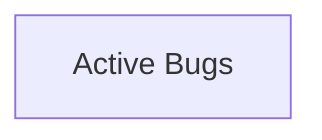

# BUGS: Day Tracker

> Managed document. Must comply with template BUGS.template.md.

<!-- APM:DATA
{
  "docType": "bugs",
  "version": 1,
  "bugs": [],
  "mermaid": "flowchart TD\n  bugs[\"Active Bugs\"]"
}
-->

## 1. Bug Workflow

### 1.1 Lifecycle States

Use these lifecycle states when tracking software bugs across the project and in generated fragments.

1.1.1 `open` - Open: Newly reported and awaiting triage.
1.1.2 `triaged` - Triaged: Validated, categorized, and ready for prioritization.
1.1.3 `in_progress` - In Progress: Active investigation or remediation is underway.
1.1.4 `blocked` - Blocked: Work cannot continue until a dependency or decision is resolved.
1.1.5 `fixed` - Fixed: A code or configuration change is ready for validation.
1.1.6 `verifying` - Verifying: The proposed fix is being tested in the target environment.
1.1.7 `resolved` - Resolved: The issue has been verified as fixed.
1.1.8 `closed` - Closed: The record is complete and retained for history.
1.1.9 `regressed` - Regressed: The issue returned after a prior fix and needs renewed attention.

### 1.2 Active And Archived Rules

Active bugs remain in Considered, Planned, or a roadmap Phase and use one of these lifecycle states: `open`, `triaged`, `in_progress`, `blocked`, `fixed`, `verifying`, or `regressed`.

Resolved and closed bugs are automatically archived. Archived bugs should not remain in the active bug list of this document.

### 1.3 Archived Bug Handling

Resolved and closed bugs are automatically archived and removed from the active bug list.

When a bug becomes archived, keep it in archived bug history rather than creating a separate workspace note.

If an archived bug moves back into an active lifecycle state, return it to the live bug list.

## 2. Active Bugs

No active bugs.

## 3. Mermaid

