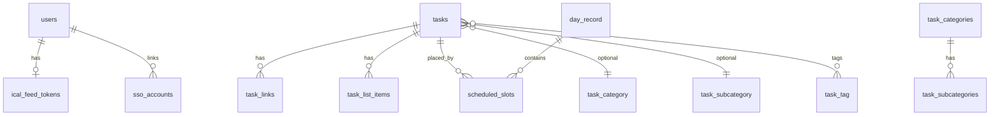

# Day Tracker – Database Documentation

This document describes **how data is stored** in Day Tracker: database files, tables, relationships, migrations, and the **authoritative schema contract**. It supersedes ad-hoc schema notes for product and engineering readers; use it alongside `contracts/schema.dbml`.

---

## 1. Executive summary

- Storage is **SQLite** for both the **master** database (accounts, global settings, shared metadata) and each **per-user** database (tasks, slots, organization, iCal subscriptions for that user).
- A separate **AI threads** SQLite file per user (`*_ai.sqlite`) stores Smart Planning conversation history; it is **not** part of the main user task DB.
- Schema changes are applied via **versioned SQL migrations**; the **DBML contract** in `contracts/schema.dbml` is the structural source of truth for reviews and codegen-style tooling.

---

## 2. Database files and runtime layout

| File / pattern | Role |
|----------------|------|
| `data/daytracker_master.sqlite` (path configurable in `config.php`) | Master DB: `users`, SSO links, global `master_app_settings`, `ical_feed_tokens`, `ical_excluded_events`, etc. |
| `data/<user_db_name>.sqlite` | Per-user DB: tasks, slots, day records, organization, iCal subscriptions/events, per-user `app_settings`. |
| `data/*_ai.sqlite` | Per-user AI thread storage (tables created via `migrations_ai/`). |
| `config.php` | Returns `data_dir`, `master_db_path`, optional API keys (OpenAI), OAuth client placeholders for SSO. |

The PHP layer resolves the current user’s DB path via `lib/db.php` (`getCurrentUserDbPath()`, `getPdo()`) using the logged-in user’s `users.db_name` row in the master database.

---

## 3. Master database (summary)

Key tables (see DBML for full columns and constraints):

- **`users`** – Username, password hash (nullable for SSO-only), `db_name` (unique per-user SQLite filename), `is_admin`, `force_password_reset`, `created_at`.
- **`sso_accounts`** – Links master user to OAuth provider + email (`provider`, e.g. `google`, `outlook`).
- **`ical_feed_tokens`** – Unguessable token for building the user’s **outbound** iCal URL (`api/ical.php`).
- **`ical_excluded_events`** – Master-level excluded external event UIDs (+ title); works with `ical_omit_uids` in settings.
- **`master_app_settings`** – Key/value global configuration: `debug`, `ai_enabled`, iCal sync intervals, timeouts, etc.

---

## 4. User database (summary)

### 4.1 Core task and schedule

- **`tasks`** – Title, priority, recurring + `recurrence_rule`, `parent_id` (task groups / legacy nesting), `group_order`, `due_date`, `list_state`, `list_style`, `is_common` (Common Tasks template), timestamps.
- **`task_links`** – URLs + optional description per task; unique `(task_id, url)`.
- **`task_list_items`** – Bullet/checklist lines: `content`, `order_index`, `completed`.
- **`day_record`** – Calendar days the app references (`date` unique `YYYY-MM-DD`).
- **`scheduled_slots`** – `day_record_id`, `task_id`, `start_time` / `end_time` (nullable for untimed), `completed`, `order_index`.

### 4.2 Per-user settings

- **`app_settings`** – Key/value (e.g. `start_hour`, `end_hour`, increment, `timezone`).

### 4.3 iCal (inbound)

- **`ical_subscriptions`** – Feed URL, `enabled`, `last_synced_at`.
- **`ical_feed_events`** – Stored occurrences from subscriptions (title, ISO start/end, `all_day`, `user_completed`, `event_type`).
- **`ical_completion_marks`** – Persists completion across feed refresh for recurring UIDs.

### 4.4 Organization

- **`task_categories`**, **`task_subcategories`**, **`task_tags`** – Names + optional `color`.
- **`task_category`**, **`task_subcategory`**, **`task_tag`** – Joins: at most one category and one subcategory per task; many tags.

---

## 5. AI database (`*_ai.sqlite`)

- Not modeled in the main `schema.dbml` user section; migrated via **`migrations_ai/`**.
- Stores **threads** and **messages** for Smart Planning (`api/ai/threads.php`).
- Demo reset may wipe `demo_ai.sqlite` to avoid leaking conversations between demo sessions.

---

## 6. Relationships (conceptual)

Foreign keys and `ON DELETE` behavior are defined in SQL migrations; the DBML file documents intended references for design review.

---

## 7. Migrations

- **`migrations/`** – Applied to **user** databases (per-user file) when users first log in or when new migrations are added.
- **`migrations_master/`** – Applied to the **master** database.
- **`migrations_ai/`** – Applied when creating/upgrading `*_ai.sqlite`.

**Rule:** Any schema change must add a new numbered migration SQL file, update **`contracts/schema.dbml`**, and update **`docs/Application-Spec.md`** / **`docs/Application-SRS.md`** when behavior-facing.

---

## 8. Integrity and tooling

- **`lib/data_integrity.php`** – Optional checks/fixes (e.g. invalid slots); invoked from the client load path where configured.
- **PHPUnit** – API tests under `tests/` assert DB-backed behavior (`tests/Api/*.php`).
- **Contract**: `contracts/schema.dbml` should stay aligned with actual SQLite DDL produced by migrations.

---

## 9. References

| Resource | Purpose |
|----------|---------|
| `contracts/schema.dbml` | Authoritative table/column/ref contract |
| `install.php` | First-time master DB creation, admin user, migration bootstrap |
| `lib/db.php` | PDO connection, paths |
| `api/common.php` | Auth gate for most endpoints |

---

_Last updated to support split documentation with `Application-Spec.md` and `Application-SRS.md`; revise when migrations add or rename tables._
