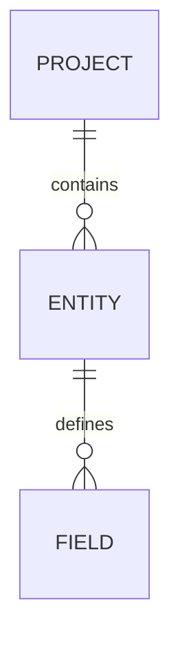

# DATABASE_SCHEMA: Day Tracker

> Managed document. Must comply with template DATABASE_SCHEMA.template.md.

<!-- APM:DATA
{
  "docType": "database_schema",
  "version": 1,
  "markdown": "# Database Schema: Day Tracker\n\n## 1. Schema Overview\n\n### 1.1 Purpose\n\n<\u0021--\nAPM-ID: database-schema-overview-purpose-schema-purpose\nAPM-LAST-UPDATED: 2026-04-06\n--\u003e\n\nPending schema purpose.\n\n### 1.2 Storage Strategy\n\n<\u0021--\nAPM-ID: database-schema-overview-storage-strategy-storage-strategy\nAPM-LAST-UPDATED: 2026-04-06\n--\u003e\n\nPending storage strategy.\n\n_Last updated: 2026-04-06_\n\n### 1.3 Sync Status\n\n- Intended Version: 0\n- Observed Version: 0\n- Sync Status: unverified\n- Drift Severity: low\n- Change Source: intended_edit\n- Pending Migration Status: comparison_required\n- Recommended Action: capture_or_compare\n- Last Compared: 2026-04-14T05:08:47.804Z\n\n- Action Summary: Capture an observed schema or define the intended schema to begin tracking drift.\n- Drift Summary: No schema comparison has been recorded yet.\n\n### 1.3.1 Recommended Work Items\n\n- No schema work items are currently generated from sync drift.\n\n### 1.3.2 Sync Audit History\n\n- No sync audit history recorded yet.\n\n### 1.4 Import Source\n\nNo import source metadata captured yet.\n\n## 2. Entities\n\nNo entities defined yet.\n## 3. Relationships\n\nNo relationships defined yet.\n## 4. Constraints\n\nNo constraints defined yet.\n## 5. Indexes\n\nNo indexes defined yet.\n## 6. Migration Notes\n\nNo migration notes defined yet.\n## 7. Open Questions\n\nNo open questions captured yet.\n## 8. Source-of-Truth and Sync Rules\n\nNo source-of-truth rules defined yet.",
  "mermaid": "erDiagram\n  PROJECT ||--o{ ENTITY : contains\n  ENTITY ||--o{ FIELD : defines",
  "editorState": {
    "overview": {
      "purpose": "",
      "storageStrategy": "",
      "versionDate": "2026-04-06T03:37:58.153Z",
      "itemIds": {
        "purpose": "database-schema-overview-purpose-schema-purpose",
        "storageStrategy": "database-schema-overview-storage-strategy-storage-strategy"
      },
      "itemSourceRefs": {
        "purpose": [],
        "storageStrategy": []
      }
    },
    "importSource": null,
    "observedSchemaModel": null,
    "syncTracking": {
      "intendedVersion": 0,
      "observedVersion": 0,
      "intendedHash": "",
      "observedHash": "",
      "syncStatus": "unverified",
      "driftSeverity": "low",
      "changeSource": "intended_edit",
      "pendingMigrationStatus": "comparison_required",
      "recommendedAction": "capture_or_compare",
      "actionSummary": "Capture an observed schema or define the intended schema to begin tracking drift.",
      "lastComparedAt": "2026-04-14T05:08:47.804Z",
      "intendedUpdatedAt": "",
      "observedCapturedAt": "",
      "driftSummary": "No schema comparison has been recorded yet.",
      "driftDetails": {
        "entities": [],
        "relationships": [],
        "indexes": [],
        "constraints": []
      },
      "actionItems": [],
      "auditHistory": []
    },
    "entities": [],
    "relationships": [],
    "constraints": [],
    "indexes": [],
    "migrations": [],
    "synchronizationRules": [],
    "openQuestions": [],
    "dbml": "// APM Schema Sync\n// Intended Version: 0\n// Observed Version: 0\n// Sync Status: unverified\n// Drift Severity: low\n// Change Source: unknown\n// Pending Migration Status: comparison_required\n// Recommended Action: capture_or_compare\n\n// Action Summary: Capture an observed schema or define the intended schema to begin tracking drift.\n// Drift Summary: No schema comparison has been recorded yet.\n// Action Item Count: 0\n\n\nProject \"Day Tracker\" {\n  database_type: \"Generic\"\n}\n\n// No schema entities defined yet.",
    "schemaModel": {
      "source": {},
      "summary": "",
      "entities": [],
      "relationships": [],
      "indexes": [],
      "constraints": [],
      "migrationNotes": [],
      "openQuestions": [],
      "mermaid": ""
    },
    "fragmentHistory": []
  }
}
-->

# Database Schema: Day Tracker

## 1. Schema Overview

### 1.1 Purpose

<!--
APM-ID: database-schema-overview-purpose-schema-purpose
APM-LAST-UPDATED: 2026-04-06
-->

Pending schema purpose.

### 1.2 Storage Strategy

<!--
APM-ID: database-schema-overview-storage-strategy-storage-strategy
APM-LAST-UPDATED: 2026-04-06
-->

Pending storage strategy.

_Last updated: 2026-04-06_

### 1.3 Sync Status

- Intended Version: 0
- Observed Version: 0
- Sync Status: unverified
- Drift Severity: low
- Change Source: intended_edit
- Pending Migration Status: comparison_required
- Recommended Action: capture_or_compare
- Last Compared: 2026-04-14T05:08:47.804Z

- Action Summary: Capture an observed schema or define the intended schema to begin tracking drift.
- Drift Summary: No schema comparison has been recorded yet.

### 1.3.1 Recommended Work Items

- No schema work items are currently generated from sync drift.

### 1.3.2 Sync Audit History

- No sync audit history recorded yet.

### 1.4 Import Source

No import source metadata captured yet.

## 2. Entities

No entities defined yet.
## 3. Relationships

No relationships defined yet.
## 4. Constraints

No constraints defined yet.
## 5. Indexes

No indexes defined yet.
## 6. Migration Notes

No migration notes defined yet.
## 7. Open Questions

No open questions captured yet.
## 8. Source-of-Truth and Sync Rules

No source-of-truth rules defined yet.

## Mermaid

