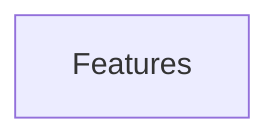

# FEATURES: Day Tracker

> Managed document. Must comply with template FEATURES.template.md.

<!-- APM:DATA
{
  "docType": "features",
  "version": 1,
  "features": [],
  "mermaid": "flowchart TD\n  features[\"Features\"]"
}
-->

## 1. Active Features

| Feature | Summary |
|---------|---------|
| **Auto Block** | Assign default block + duration on tasks; populate matching schedule blocks from a bucket via the grid icon next to hide-bucket. |
| **Add favorite to bucket** | Modal to create a task from a favorite template with editable metadata and target bucket. |
| **Bulk Quick Add details** | Shared bucket, priority, and due date when pasting multiple titles. |
| **Schedule draft tasks** | Click schedule to start a title-only draft; persisted only after naming. |
| **Task groups + rollover** | Incomplete members stay grouped; completed members leave the group after their completion day. |
| **Contact & map links** | Email, phone, and map URLs on tasks; glyphs (✉️ / 📞 / 🗺️); user settings for compose handlers; bare email/phone accepted in Link modal. |
| **Completed summary table** | In-app spreadsheet modal for filtered summary (same columns as Export); optional open in new tab. |

## 2. Mermaid

