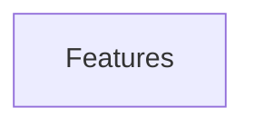

# FEATURES: Day Tracker

> Managed document. Must comply with template FEATURES.template.md.

<!-- APM:DATA
{
  "docType": "features",
  "version": 1,
  "features": [],
  "mermaid": "flowchart TD\n  features[\"Features\"]"
}
-->

## Planned Features

No entries.

## Implemented Features

No entries.

## Mermaid

