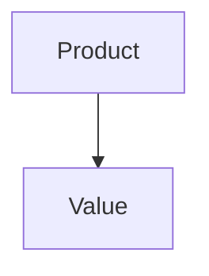

# PRD: Day Tracker

> Managed document. Must comply with template PRD.template.md.

<!-- APM:DATA
{
  "docType": "prd",
  "version": 1,
  "markdown": "# Product Requirements Document: Day Tracker\n\n## 1. Executive Summary\n\n<\u0021--\nAPM-ID: prd-executive-summary-executive-summary\nAPM-LAST-UPDATED: 2026-04-09\n--\u003e\n\nExecutive Summary Here\n\n_Last updated: 2026-04-09_\n\n## 2. Product Overview\n\n### 2.1 Product Name\n\n<\u0021--\nAPM-ID: prd-product-overview-product-name-product-name\nAPM-LAST-UPDATED: 2026-04-09\n--\u003e\n\nDay Tracker\n\n### 2.2 Product Vision\n\n<\u0021--\nAPM-ID: prd-product-overview-product-vision-product-vision\nAPM-LAST-UPDATED: 2026-04-09\n--\u003e\n\nPending product vision.\n\n_Last updated: 2026-04-09_\n\n### 2.3 Target Audience\n\n- No target audiences defined yet\n\n### 2.4 Key Value Propositions\n\n- No value propositions defined yet\n\n## 3. Functional Requirements\n\n### 3.1 Workflows\n\nNo workflows defined yet.\n### 3.2 User Actions\n\nNo user actions defined yet.\n### 3.3 System Behaviors\n\nNo system behaviors defined yet.\n## 4. Non-Functional Requirements\n\n### 4.1 Usability\n\n<\u0021--\nAPM-ID: prd-non-functional-requirements-usability-usability\nAPM-LAST-UPDATED: 2026-04-09\n--\u003e\n\nPending usability guidance.\n\n### 4.2 Reliability\n\n<\u0021--\nAPM-ID: prd-non-functional-requirements-reliability-reliability\nAPM-LAST-UPDATED: 2026-04-09\n--\u003e\n\nPending reliability requirements.\n\n### 4.3 Accessibility\n\n<\u0021--\nAPM-ID: prd-non-functional-requirements-accessibility-accessibility\nAPM-LAST-UPDATED: 2026-04-09\n--\u003e\n\nPending accessibility requirements.\n\n### 4.4 Security\n\n<\u0021--\nAPM-ID: prd-non-functional-requirements-security-security\nAPM-LAST-UPDATED: 2026-04-09\n--\u003e\n\nPending security requirements.\n\n### 4.5 Performance\n\n<\u0021--\nAPM-ID: prd-non-functional-requirements-performance-performance\nAPM-LAST-UPDATED: 2026-04-09\n--\u003e\n\nPending performance requirements.\n\n_Last updated: 2026-04-09_\n\n## 5. Technical Architecture\n\nNo technical architecture decisions captured yet.\n## 6. Implementation Plan\n\n### 6.1 Sequencing\n\nNo sequencing defined yet.\n### 6.2 Dependencies\n\nNo dependencies defined yet.\n### 6.3 Milestones\n\nNo milestones defined yet.\n## 7. Success Metrics\n\nNo success metrics defined yet.\n## 8. Risks and Mitigations\n\nNo risks tracked yet.\n## 9. Future Enhancements\n\nPlanned and implemented feature work is tracked in FEATURES.md. Keep only product-facing future references here when they materially affect the product definition.\n\nNo future enhancements captured yet.\n## 10. Applied Fragments\n\nNo PRD fragments have been merged or integrated yet.\n## 11. Conclusion\n\nPending conclusion.",
  "mermaid": "flowchart TD\n  product[\"Product\"] --\u003e value[\"Value\"]",
  "editorState": {
    "executiveSummary": {
      "text": "Executive Summary Here",
      "versionDate": "2026-04-09T22:41:28.393Z",
      "stableId": "prd-executive-summary-executive-summary",
      "sourceRefs": []
    },
    "productOverview": {
      "productName": "Day Tracker",
      "vision": "",
      "targetAudiences": [],
      "keyValueProps": [],
      "versionDate": "2026-04-09T22:41:28.393Z",
      "itemIds": {
        "productName": "prd-product-overview-product-name-product-name",
        "vision": "prd-product-overview-product-vision-product-vision"
      },
      "itemSourceRefs": {
        "productName": [],
        "vision": []
      }
    },
    "functionalRequirements": {
      "workflows": [],
      "userActions": [],
      "systemBehaviors": [],
      "versionDate": "2026-04-09T22:41:28.393Z"
    },
    "nonFunctionalRequirements": {
      "usability": "",
      "reliability": "",
      "accessibility": "",
      "security": "",
      "performance": "",
      "versionDate": "2026-04-09T22:41:28.393Z",
      "itemIds": {
        "usability": "prd-non-functional-requirements-usability-usability",
        "reliability": "prd-non-functional-requirements-reliability-reliability",
        "accessibility": "prd-non-functional-requirements-accessibility-accessibility",
        "security": "prd-non-functional-requirements-security-security",
        "performance": "prd-non-functional-requirements-performance-performance"
      },
      "itemSourceRefs": {
        "usability": [],
        "reliability": [],
        "accessibility": [],
        "security": [],
        "performance": []
      }
    },
    "technicalArchitecture": [],
    "implementationPlan": {
      "sequencing": [],
      "dependencies": [],
      "milestones": [],
      "versionDate": "2026-04-09T22:41:28.393Z"
    },
    "successMetrics": [],
    "risksMitigations": [],
    "futureEnhancements": [],
    "appliedFragments": [],
    "conclusion": ""
  }
}
-->

# Product Requirements Document: Day Tracker

## 1. Executive Summary

<!--
APM-ID: prd-executive-summary-executive-summary
APM-LAST-UPDATED: 2026-04-09
-->

Executive Summary Here

_Last updated: 2026-04-09_

## 2. Product Overview

### 2.1 Product Name

<!--
APM-ID: prd-product-overview-product-name-product-name
APM-LAST-UPDATED: 2026-04-09
-->

Day Tracker

### 2.2 Product Vision

<!--
APM-ID: prd-product-overview-product-vision-product-vision
APM-LAST-UPDATED: 2026-04-09
-->

Pending product vision.

_Last updated: 2026-04-09_

### 2.3 Target Audience

- No target audiences defined yet

### 2.4 Key Value Propositions

- No value propositions defined yet

## 3. Functional Requirements

### 3.1 Workflows

No workflows defined yet.
### 3.2 User Actions

No user actions defined yet.
### 3.3 System Behaviors

No system behaviors defined yet.
## 4. Non-Functional Requirements

### 4.1 Usability

<!--
APM-ID: prd-non-functional-requirements-usability-usability
APM-LAST-UPDATED: 2026-04-09
-->

Pending usability guidance.

### 4.2 Reliability

<!--
APM-ID: prd-non-functional-requirements-reliability-reliability
APM-LAST-UPDATED: 2026-04-09
-->

Pending reliability requirements.

### 4.3 Accessibility

<!--
APM-ID: prd-non-functional-requirements-accessibility-accessibility
APM-LAST-UPDATED: 2026-04-09
-->

Pending accessibility requirements.

### 4.4 Security

<!--
APM-ID: prd-non-functional-requirements-security-security
APM-LAST-UPDATED: 2026-04-09
-->

Pending security requirements.

### 4.5 Performance

<!--
APM-ID: prd-non-functional-requirements-performance-performance
APM-LAST-UPDATED: 2026-04-09
-->

Pending performance requirements.

_Last updated: 2026-04-09_

## 5. Technical Architecture

No technical architecture decisions captured yet.
## 6. Implementation Plan

### 6.1 Sequencing

No sequencing defined yet.
### 6.2 Dependencies

No dependencies defined yet.
### 6.3 Milestones

No milestones defined yet.
## 7. Success Metrics

No success metrics defined yet.
## 8. Risks and Mitigations

No risks tracked yet.
## 9. Future Enhancements

Planned and implemented feature work is tracked in FEATURES.md. Keep only product-facing future references here when they materially affect the product definition.

No future enhancements captured yet.
## 10. Applied Fragments

No PRD fragments have been merged or integrated yet.
## 11. Conclusion

Pending conclusion.

## Mermaid

