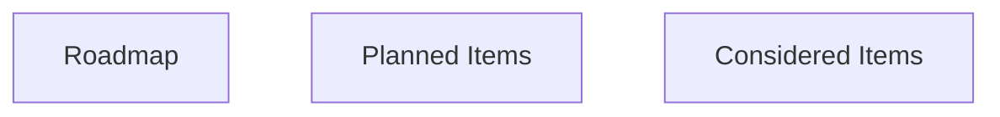

# ROADMAP: Day Tracker

> Managed document. Must comply with template ROADMAP.template.md.

<!-- APM:DATA
{
  "docType": "roadmap",
  "version": 1,
  "phases": [],
  "tasks": [],
  "features": [],
  "bugs": [],
  "templateVersion": "2.0",
  "mermaid": "flowchart TD\n  roadmap[\"Roadmap\"]\n  planned[\"Planned Items\"]\n  considered[\"Considered Items\"]"
}
-->

## Executive Summary

Day Tracker roadmap generated from roadmap phases, linked tasks, and enabled workspace plugins.

- Template Version: 2.0
- Template Last Updated: 2026-03-28

> AI Agent instruction: Use feature IDs in this roadmap to cross-reference planned entries in FEATURES.md. Ignore implemented features unless explicitly asked to review history.
> AI Agent instruction: If you need to propose roadmap changes, create or update a ROADMAP_FRAGMENT document that complies with ROADMAP_FRAGMENT.template.md instead of editing ROADMAP.md directly.
> AI Agent instruction: If roadmap work changes implementation scope, create or update a PRD fragment instead of editing PRD.md directly.

## Phased Implementation Plan

## Phases

## Phases

No roadmap phases yet.

## Planned Features

No planned features.

## Considered Features

No considered features.

## Mermaid

