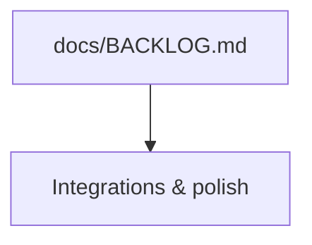

# ROADMAP: Day Tracker

> Phased roadmap content is not maintained in this file yet. Use the links below.

## Where to look

- **Open work & bugs:** [`BACKLOG.md`](BACKLOG.md)
- **Managed roadmap template (APM):** [`ROADMAP.template.md`](ROADMAP.template.md)
- **Fragment template:** [`ROADMAP_FRAGMENT.template.md`](ROADMAP_FRAGMENT.template.md)

---

<!-- Legacy APM marker retained for tools that expect it. -->

<!-- APM:DATA
{
  "docType": "roadmap",
  "version": 1,
  "phases": [],
  "tasks": [],
  "features": [],
  "bugs": [],
  "templateVersion": "2.0",
  "mermaid": "flowchart TD\n  backlog[\"docs/BACKLOG.md\"] --> ux[\"Integrations & polish\"]"
}
-->

## Mermaid

